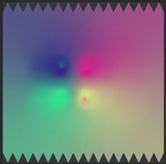

# 노멀 맵에 이상한 다채로운 그레이디언트가 있음

빵집의 출력은 매우 강한 다채로운 그레이디언트의 집합입니다.

## 설명

컬러풀한 그레이디언트는 일반적으로 베이킹 프로세스 동안 고-폴리 및 저-폴리 메시 사이에 불일치가 있을 때 발생한다. 이러한 불일치는 다음과 같은 이유로 설명될 수 있습니다.

* 높은 폴리 및 낮은 폴리 메시 <b>서로 제대로 겹치지 않음</b>(아래 이미지 참조).
* 하이-폴리는 로우-폴리가 포함하려고 하는 <b>누락된 도형</b>입니다.
* 하이-폴리 또는 로우-폴리 메시는 반전된 정점 법선을 갖는다.

이 경우 베이킹 프로세스는 존재하지 않는 도형을 일치시켜 빈 모양을 만듭니다. 베이커는 <b>확산</b>을 사용하지 않는 한 색상 그레이디언트를 만드는 텍스처의 인접 픽셀에서 추출한 색상으로 이 빈 영역을 채웁니다.

## 해결 방법

망 사이에 겹치지 않는 몇 가지 가능한 이유를 고려할 때 몇 가지 해결책이 필요합니다 :

* 모든 메시가 일관성을 유지하도록 메시 변형을 고정/재설정(x-형식 등 재설정)합니다
* 3D 모델링 소프트웨어에서 낮은 폴리 메쉬와 높은 폴리 메쉬를 모두 가져와서 적절하게 겹치는지 확인합니다
* [이름별 일치](../../features/matching-by-name/matching-by-name.md) 기능을 사용하는 경우 이름 지정 규칙이 올바른지 확인하십시오(메시 이름을 인쇄해야 하는 로그 파일을 굽은 다음 확인하여 확인할 수 있음).

### 예

다음은 고-폴리 및 저-폴리 구를 갖는 예이다. 왼쪽의 메시는 상위-폴리가 이동했기 때문에 겹치지 않습니다.

