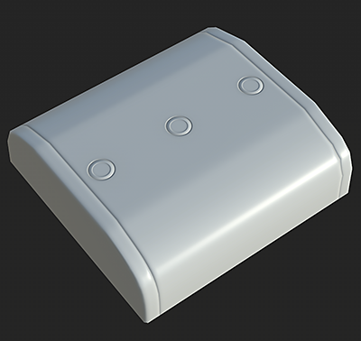

# 이름별 일치

이름별 매칭은 Substance Baker에서 이름을 기반으로 낮은 폴리 및 높은 폴리 메시를 분리하는 데 사용할 수 있는 필터링 방법의 이름입니다.

이 기능은 깔끔한 텍스처를 달성하기 위해 베이킹 프로세스 동안 서로에 대한 기하학적 출혈을 방지하는 데 매우 유용하다. 동일한 결과를 얻기 위해 메쉬를 멀리 이동할 필요가 없습니다(종종 &quot;폭발&quot;이라고 함).

## 이름별 일치를 사용하는 경우

### 메쉬 출혈을 동반한 노멀 맵 베이킹

이 예에서 캐릭터의 머리 위에 있는 헬멧이 캐릭터 얼굴에 번집니다.

[이름별 일치]를 활성화하면 헬멧을 무시하고 얼굴을 제대로 구울 수 있습니다. *이 결과는 기본 일치 설정을 기반으로 합니다.*

| *메시* | *이름별 일치 해제* | *에서*&#x200B;이름별 일치 |
| --- | --- | --- |
| {width="250px"} | {width="250px"} | {width="250px"} |

### 유동 형상의 배경 무시

이 예에서 상자의 상단에 있는 &quot;버튼&quot;은 부동 기하학이며 높은 폴리 메쉬에 연결되지 않습니다. 따라서 기본적으로 모양 테두리를 표시할 아래의 상자에 그림자가 표시됩니다.

**뒷면 무시** 설정에 대해 이름별 일치 옵션을 활성화하면 단추 아래 영역을 무시하면서 앰비언트 오클루전을 단일 상자로 보이게 할 수 있습니다.*이 결과는 [뒷면 무시] 설정을 사용했기 때문입니다.*

| *메시* | *이름별 일치 해제* | *에서*&#x200B;이름별 일치 |
| --- | --- | --- |
| {width="250px"} | {width="250px"} | {width="250px"} |

## 이름별 매칭 작동 방식

이름별 일치 시스템은 낮은 폴리 메시와 높은 폴리 메시 모두에서 형상 이름을 읽고 키워드(접미어)를 사용하여 이름을 식별/일치시키는 방식으로 작동합니다. 기본적으로 베이커는 특정 접미어를 사용하지만 변경할 수 있습니다(아래 참조).

지원되는 현재 접미사는 다음과 같습니다.

| *접미어 유형* | *기본값* | *사용* |
| --- | --- | --- |
| 높은 폴리 | *\_high* | 낮은 폴리 메시와 일치하도록 높은 폴리 메시의 이름을 분리하는 데 사용됩니다. |
| 낮은 폴리 | *\_low* | 높은 폴리 메시와 일치하도록 낮은 폴리 메시의 이름을 분리하는 데 사용됩니다. |
| 백페이스를 무시 | *\_ignorebf* | 앰비언트 오클루전과 같은 보조 광선을 사용하는 제빵사의 백페이스를 무시하는 데 사용됩니다.*이 접미사는 높은 폴리 메시에만 있어야 합니다(예:**mesh\_high\_ignorebf***). |

이 기능이 제대로 작동하도록 하기 위해 고려해야 할 몇 가지 규칙은 다음과 같습니다.

* 기본적으로 **해제**&#x200B;이므로 [공통 매개 변수](../../bakers-settings/common-parameters/common-parameters.md)에서 이름별 일치를 사용하도록 설정해야 합니다.
* 일부 베이커(예: [앰비언트 오클루전](../../bakers-settings/ambient-occlusion-from/ambient-occlusion-from-mesh.md))는 보조 광선을 생성하므로 이름별 보조 일치 설정을 사용하도록 설정할 수 있습니다.
* 일치는 대/소문자를 구분하며, &quot;**Vela**&quot;이라는 메시가 &quot;**Vela**&quot;이라는 다른 메시와 일치하지 않음을 의미합니다.
* 접미어가 형상 이름에 있는 위치를 기준으로 여러 메시를 일치시킬 수 있습니다.

다음은 일치 작동 방식에 대한 예입니다(기본 접미어 사용).

| 낮은 폴리 이름 | 높은 Poly와 일치 | 높은 Poly와 일치하지 않음 |
| --- | --- | --- |
| <ul data-preserve-html="true"><li data-preserve-html="true">body_low</li></ul> | <ul data-preserve-html="true"><li data-preserve-html="true">body_high</li><li data-preserve-html="true">body_high_top</li><li data-preserve-html="true">body_high_1</li><li data-preserve-html="true">body_high_2</li></ul> | <ul data-preserve-html="true"><li data-preserve-html="true">신체 높음</li><li data-preserve-html="true">body_top_high</li></ul> |
| <ul data-preserve-html="true"><li data-preserve-html="true">Head_low</li></ul> | <ul data-preserve-html="true"><li data-preserve-html="true">Head_high</li></ul> | <ul data-preserve-html="true"><li data-preserve-html="true">head_high</li></ul> |
| <ul data-preserve-html="true"><li data-preserve-html="true">Leg_low_top</li></ul> | <ul data-preserve-html="true"><li data-preserve-html="true">Leg_high</li><li data-preserve-html="true">Leg_high_top</li><li data-preserve-html="true">Leg_high_high_top</li></ul> | <ul data-preserve-html="true"><li data-preserve-html="true">Leg_top_high</li></ul> |

## 베이커 설정 방법

### 이름별 일치 사용

이름별 일치는 Baker 설정의 [공통 매개 변수](../../bakers-settings/common-parameters/common-parameters.md)에서 사용하도록 설정할 수 있습니다.

| *소프트웨어* | *구성 설정* |
| --- | --- |
| **Substance Painter** | <ol class="steps" data-preserve-html="true"> <li class="step" data-preserve-html="true">     [텍스처 세트 설정]을 통해 [베이킹] 창을 엽니다.    </li> <li class="step" data-preserve-html="true">     공통 매개변수를 표시합니다.    </li> <li class="step" data-preserve-html="true">     <strong>일치</strong> 설정을 &quot;항상&quot;에서 &quot;메시 이름별&quot;로 변경하십시오.      </li> </ol> |
| **Substance Designer** | <ol class="steps" data-preserve-html="true"> <li class="step" data-preserve-html="true">     [탐색기] 창에서 연결된 메시를 마우스 오른쪽 단추로 클릭하여 [굽기] 창을 엽니다.    </li> <li class="step" data-preserve-html="true">     <strong>일치</strong> 설정을 &quot;항상&quot;에서 &quot;메시 이름별&quot;로 변경합니다.        </li> </ol> |

### 접미어 이름 변경

기본 접미어는 \_low 및 \_high 이며 다음과 같은 방법으로 변경할 수 있습니다.

* **Substance Painter**: [굽기 창](../../getting-started/software-interface/3d-painter/substance-3d-painter.md)에서 공통 매개 변수 내에 있습니다.
* **Substance Designer**: [프로젝트 설정](https://experienceleague.adobe.com/en/docs/substance-3d-designer/using/workspace/preferences/project-settings)의 굽기 설정 아래에 있습니다.

## zBrush의 높은-폴리 메시

zBrush에서 내보낸 하이 폴리 메시를 [이름별 일치] 기능으로 굽는 데 사용할 수 있지만 일부 설정은 다음과 같을 수 있습니다.

| *파일 형식* | *설명* |
| --- | --- |
| **FBX** | 특정 매개 변수를 활성화하거나 비활성화하지 않고 망 파일을 그대로 사용할 수 있습니다. |
| **OBJ** | zBrush에서 내보낸 OBJ 파일은 기본적으로 **이름별 일치**&#x200B;에서 작동하지 않습니다. 대신 망 파일 이름을 사용하여 이름으로 망을 일치시키도록 Substance Painter에게 지시할 수 있습니다.이렇게 하려면 다음 사항을 확인하십시오.<ol data-preserve-html="true"><li data-preserve-html="true"><strong>각</strong> 하위 도구에 대한 그룹(Grp) 매개 변수를 <strong>사용 안 함</strong>합니다.</li><li data-preserve-html="true">OBJ 파일 <strong>이름</strong>(예: <strong>body_high.obj</strong>).</li></ol>  |
