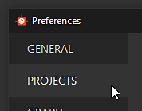

# 접선 공간

Substance Bakers는 저폴리 메시에 있는 접선 및 이항식을 로드하거나 이를 다시 계산할 수 있습니다. 이 값을 다시 계산할 때 사용자 정의 탄젠트 공간 알고리즘을 정의할 수 있습니다(기본적으로 MikkTSpace임).

## 탄젠트 공간 플러그인 목록

## Substance Painter

Substance Painter에서 Tangent Space 플러그인은 변경할 수 없으며 항상 **MikkTSpace**&#x200B;이(가) 됩니다. 그러나 다른 응용 프로그램과 호환되도록 동작을 약간 변경하는 매개 변수가 있습니다.

| *매개 변수* | *호환* *응용 프로그램* |
| --- | --- |
| **조각당 탄젠트 공간 계산: 사용 안 함** | xNormal, Unity 5.3 이상과 호환. |
| **조각당 탄젠트 공간 계산: 사용** | Unreal Engine 4, Blender 및 Unity HDRP 워크플로우와 호환됩니다. |

## Substance Designer

Substance Designer은 다음 알고리즘을 지원합니다.

| *파일 이름* | *설명* |
| --- | --- |
| **mikktspace.dll** | MikkTSpace, Tangent Space 알고리즘 Morten S. Mikkelsen에 기초합니다.xNormal, Unity 5.3 이상과 호환. |
| **mikkunrealtspace.dll** | MikkTSpace, Tangent Space 알고리즘 Morten S. Mikkelsen에 기초합니다.Unreal Engine 4, Blender 및 Unity HDRP 워크플로우와 호환됩니다. |
| **unityspace.dll** | 유니티 4에 기반한 탄젠트 공간 알고리즘. |

>[!NOTE]
>
> 사용자 정의 Tangent Space 플러그인을 작성할 수 있습니다. 헤더 파일 **tangentspaceplugin.h**&#x200B;은(는) **Substance Designer/SDK/tangentspace** 아래의 설치 폴더에서 사용할 수 있으며 인터페이스로 사용할 수 있습니다.

## 사용자 정의 탄젠트 공간 설정

## Substance Painter

현재 Substance Painter에서 사용자 지정 탄젠트 공간 플러그인을 지원하지 않습니다. 즉, 탄젠트 및 이항식이 낮은 폴리 메시(프로젝트를 생성하는 데 사용됨)에 없으면 MikkTSpace 알고리즘을 기반으로 재계산됩니다.

## Substance Designer

Substance Designer에서 탄젠트 공간 알고리즘을 설정하려면 다음 단계를 수행합니다.

1. **편집** > **환경 설정**&#x200B;을 선택합니다.

   
1. **프로젝트**&#x200B;를 클릭합니다.

   
1. **일반** 탭으로 이동합니다. 섹션 **3D 장면**&#x200B;이 표시될 때까지 스크롤합니다.

   
1. **점 세 개**(...)를 클릭합니다. 사용자 정의 플러그인을 로드합니다.

## Substance 자동화 툴킷

자동화 툴킷을 사용하여 굽는 경우 특정 명령줄 인수를 사용하여 Tangent Space 플러그인을 지정할 수 있습니다.

```
sbsbaker normal-from-mesh --tangent-space-plugin "C:/Substance Designer/plugins⁄tangentspace⁄mikktspace.dll" ...
```
