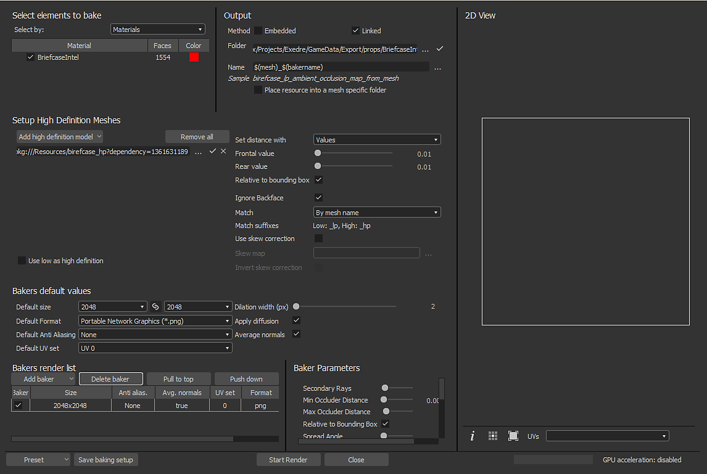

# Substance 3D Designer

[탐색기](https://helpx.adobe.com/substance-3d/unlisted/documentation/sddoc/the-explorer-129368147.html) 창에서 메시 파일을 통해 베이킹 창에 액세스할 수 있습니다. 메쉬 이름을 마우스 오른쪽 단추로 클릭하고 &quot;**모델 정보 구울**&quot;을(를) 선택하여 구울 창을 엽니다.

## 개요

{width="500px"}

의 베이킹 창은 아래에 설명된 여러 개의 패널로 분할됩니다.

### 분리할 요소

이 패널은 베이킹을 수행하는 데 사용할 저-폴리 메쉬 부분을 제어합니다.

이 패널에는 낮은 폴리 메시 파일 내부에 있는 형상이 나열됩니다. 기본적으로 목록은 파일에 있는 개별 재질을 기반으로 하지만 관련된 경우 하위 메시로 전환할 수 있습니다. 베이킹 과정에서 무시되어야 하는 요소는 선택 해제할 수 있습니다.

### 출력

이 패널은 구워진 텍스처가 위치할 위치를 제어합니다.

| *매개 변수* | *설명* |
| --- | --- |
| **메서드** | 구워진 텍스처가 Substance 패키지와 함께 저장되는 방식을 제어합니다.가능한 값:<ul data-preserve-html="true"><li data-preserve-html="true"><strong>임베드됨</strong> : 구워진 텍스처는 특정 이름을 사용하여 Substance 패키지 옆의 하위 폴더에 저장됩니다.</li><li data-preserve-html="true"><strong>연결됨</strong>(기본값) : 구운 텍스처는 정의된 폴더에 저장된 다음 패키지된 Substance에서 참조됩니다.</li></ul> |
| **폴더** | 저장 시 구워진 텍스처의 위치입니다. 세 개의 점 버튼을 클릭하여 파일 대화 상자를 열고 내보내기 폴더를 선택합니다.폴더가 실제로 존재하는지 여부를 나타내는 확인 표시가 오른쪽에 표시됩니다. |
| **이름** | 구운 텍스처의 이름 지정 규칙. 점 세 개 버튼을 클릭하여 드롭다운 메뉴를 열고 다른 자리 표시자(이름, 사용자 정의, 재질, 메시)를 삽입합니다. |
| **샘플** | 파일 이름을 시뮬레이션하여 이름 지정 규칙을 테스트합니다. |
| **메시 관련 폴더에 리소스 배치** | 활성화되면 구워진 텍스처가 메시 파일이라는 이름의 폴더 안에 저장됩니다. |

### 고해상도 메시

이 패널은 하이 폴리 메쉬 목록 및 관련 설정을 제어합니다. 자세한 내용은 [공통 매개 변수](../../../bakers-settings/common-parameters/common-parameters.md)를 참조하십시오.

### 기본값

자세한 내용은 [공통 매개 변수](../../../bakers-settings/common-parameters/common-parameters.md)를 참조하십시오.

### Baker 목록 및 설정

베이커는 당신이 생성하려는 구운 텍스처를 선택할 수 있는 곳입니다. 기본적으로 목록은 비어 있습니다.

* **새 제빵사 추가:** &quot;제빵사 추가&quot; 단추를 클릭하세요.
* **제빵사 제거:** 목록에서 제빵사를 선택한 다음 &quot;제빵사 삭제&quot; 단추를 클릭합니다.
* **제빵사를 맨 위로 이동:** 목록에서 제빵사를 선택한 다음 &quot;맨 위로 당기기&quot; 단추를 클릭합니다.
* **제빵사 아래로 이동:**&#x200B;목록에서 제빵사를 선택한 다음, &quot;누르기&quot; 버튼을 클릭합니다.

상속의 각 제빵사는 기본적으로 기본값을 상속합니다(위 참조). 예를 들어 크기(해상도)는 베이커 행의 셀을 클릭하여 재정의할 수 있습니다. 줄의 다른 설정에서도 마찬가지입니다.

목록에서 베이커를 클릭하면 베이커 매개변수 보기가 특정 매개변수로 업데이트됩니다.

특정 매개 변수에 대한 자세한 내용은 [베이커 설정](../../../bakers-settings/bakers-settings.md)을 참조하세요.
