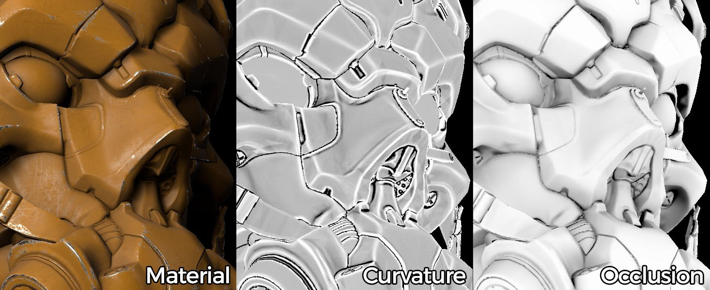

# 베이킹이란 무엇입니까?

(크레딧: [Paolo Cignoni](https://commons.wikimedia.org/wiki/File:Normal_map_example.png) - [CC BY-SA 1.0](https://creativecommons.org/licenses/by-sa/1.0))

굽기는 **3D 메시**&#x200B;와 관련된 **정보를**&#x200B;텍스처&#x200B;**파일([비트맵](https://en.wikipedia.org/wiki/Raster_graphics))에 저장**&#x200B;하는 프로세스 이름입니다. 대부분의 경우 이 프로세스에는 다른 메시가 포함됩니다. 이 경우, 제1 메쉬의 정보는 제2 메쉬 UV로 전달된 후 텍스처에 저장된다.

일부 응용 프로그램에서는 정보 굽기를 메시 속성(예: 꼭짓점 색상)으로 지원할 수 있지만, Substance Baker에서는 정보를 텍스처 아래까지만 분리할 수 있습니다. 그러나 망 속성을 읽고 꼭짓점 색상과 같은 텍스처로 베이킹할 수 있습니다.

## 굽는 게 필요한가요?

Substance 소프트웨어는 텍스처를 생성하고 이러한 텍스처는 메쉬 기하학과 관련된 정보를 사용하여 향상될 수 있습니다.\
많은 필터와 재료가 구운 텍스처를 보고 3D 메쉬의 특정 모양에 맞게 적용될 수 있습니다. 베이킹은 주변 그림자가 있을 수 있는 위치, 형상의 가장자리 등에 대한 정보를 제공할 수 있습니다.

예 : 오래된 차는 한동안 움직이지 않았기 때문에 아래쪽에 녹이 적용되어 있을 수 있습니다. 위치 맵을 베이킹하면 녹 발생기에 공급되어 적합한 텍스처를 생성하는 메시 상의 하단이 어디에 있는지 알 수 있습니다.

{width="500px"}

## 베이킹은 어떻게 작동하나요?

각 제빵사는 고유한 결과를 생성하기 위해 특정 작업을 수행하지만 일반적으로 제빵 프로세스에는 두 가지 가능한 방법이 포함됩니다.

* **하나의 메시로 굽기** : 정보를 생성하기 위해 현재 메시에 의존합니다.
* **한 메시에서 다른 메시로 베이킹** : 소스 메시에서 정보를 계산하고 결과를 다른 메시로 전송합니다.

이러한 베이킹 프로세스는 메쉬 특성에 의존하며, 이는 메쉬가 깨끗해야 하고 그 기하학에서 가능한 결함을 배제해야 하는 이유입니다.

## 어떤 정보를 얻을 수 있나요?

많은 유형의 정보가 요약될 수 있습니다. 그러나 나중에 더 발전된 결과를 만들기 위해 외삽할 수 있기 때문에 일반적으로 특정 집합만 필요하다. 이것이 여러 소프트웨어에서 발견될 수 있는 일반적인 형태의 베이킹 프로세스가 있는 이유이다.

예를 들어 Substance 소프트웨어는 다음과 같은 정보를 출력할 수 있습니다 .

* **주변 오클루전**(주변 그림자)
* **표준** 정보(벡터 방향으로 저장된 표면 세부 정보 변형)
* **방향**(위쪽 또는 아래쪽, 왼쪽 또는 오른쪽 등)
* **곡률**(형상의 가장자리 및 공동)
* **위치**(정규화된 큐브 내부의 기하 도형의 상대 위치)

자세한 내용은 [각 제빵사의 설명서](../../bakers-settings/bakers-settings.md)를 참조하십시오.

## &#39;regular&#39;와 &#39;from mesh&#39; 베이커의 차이

베이커들은 프로세스에 따라 다양한 구현을 사용한다. 일반적으로 **메시**&#x200B;에서 베이커는 광선 추적 기술을 사용하여 한 모델에서 다른 모델로 데이터를 추출하고 내보냅니다.
