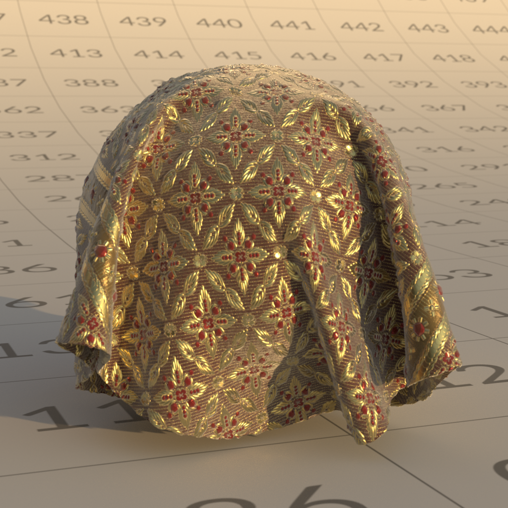

# OpenPBR

[**이 페이지의 오프라인 버전을 다운로드합니다.**](../assets/openpbrf/openpbr.pdf)

**OpenPBR**&#x200B;은(는) 서로 다른 3D 도구, 렌더러 및 파이프라인에서 재료를 설명하는 일관되고 예측 가능한 방법을 제공하도록 설계된 물리적 기반의 개방형 표면 음영 모델입니다. 이 표준은 광범위한 실제 표면을 표현할 수 있는 포괄적인 단일 재질 모델을 정의하는 동시에 물리적으로 의미 있는 매개 변수를 사용하여 보다 스타일리시한 모양이나 아티스트 중심의 스타일을 지원할 수 있을 만큼 유연합니다.

이 모델은 이름이 비슷하게 작동하지만 응용 프로그램 간에 매개 변수 정의 및 물리적 가정이 다른 &quot;표준&quot; 셰이더들 간의 오래된 불일치를 해결합니다. 물리적 기반 렌더링 원칙에 기반을 둔 OpenPBR은 재질을 실제 조명 동작 관점에서 설명하고 에너지 절약, 직관적인 매개 변수 범위 및 안정적인 조명 응답을 강조합니다. OpenPBR은 특정 사용자 인터페이스를 규정하기 보다는 재료가 기본 수준에서 작동하는 방식을 정의하여, 도구가 응용 프로그램과 파이프라인 간에 에셋이 이동할 때 일관된 시각적 결과를 유지하면서 자신만의 방식으로 모델을 구현할 수 있도록 합니다.

이 문서는 OpenPBR 이해 및 작업을 위한 아티스트 중심 가이드입니다. 모델의 기본 원리, 구성 요소가 실제 조명 동작을 어떻게 설명하는지, 이러한 아이디어가 어떻게 실질적인 재료 생성으로 전환되는지 설명합니다. 이 가이드는 특정 애플리케이션에 초점을 맞추기보다는 다양한 소프트웨어 환경에서 일관되고 전송 가능한 물리적, 강인하고 물리적으로 그럴듯한 재질을 구축하려는 모양 개발, 텍스처링 및 렌더링을 포함하는 분야에서 작업하는 3D 아티스트를 위한 것입니다.

>[!NOTE]
>
> 이미 OpenPBR으로 작업하고 있고 기술 지원을 찾고 있다면 [OpenPBR FAQ](openpbr-faq.md)에서 질문에 대한 답변을 이미 얻을 수 있습니다.

*위의 OpenPBR 데모 장면은 Nikie Monteleone이 만들었습니다. 이 문서의 예제 재질 및 채널 렌더링은 Celine Dameron에 의해 만들어졌습니다.*

## 상호 운용성 및 파일 표준

### OpenPBR과 공유된 재질 언어

OpenPBR의 핵심 목표 중 하나는 재질이 도구 간에 이동하는 방식을 개선하는 것입니다. 단일 렌더러나 응용 프로그램에 연결된 셰이더라기 보다는 재료가 빛에 응답하는 방식을 설명하는 일반적인 방법인 **공유 음영 모델**&#x200B;을 정의합니다.

아티스트에게 있어 이는 OpenPBR 자료가 단순히 예를 들어 &#39;Adobe 자료&#39;나 &#39;오토데스크 자료&#39;가 아니라 여러 도구로 이해할 수 있는 표면 및 볼륨 동작에 대한 설명입니다. 목적은 한 응용 프로그램에서 작성된 자료가 OpenPBR 모델을 지원하는 한 다른 응용 프로그램에서 일관되게 해석될 수 있다는 것입니다.

### 에셋 교환 문제

OpenPBR 사양은 프로덕션의 오랜 과제를 명시적으로 인정합니다. **재료가 응용 프로그램 간에 잘 이동하지 않습니다**. 렌더러마다 서로 다른 매개 변수 이름, 음영 가정 및 기본 모델을 사용하는 경우가 많으므로 모양을 일치시키는 것이 어렵고 시간이 많이 걸립니다.

OpenPBR은 이 문제에 대한 응답으로 설계되었습니다. 금속, 유전체, 층상 물질, 전송, 산포 등의 일반적인 생산 요구를 충족하는 물리적으로 접지된 단일 재질 모델을 정의하여 안정적인 교환 목표를 제공합니다. 이는 모든 상황에서 완벽한 시각적 일치를 보장하지는 않지만 독점 셰이더 모델에 비해 모호성을 크게 줄입니다.

아티스트에게 실질적인 차이점은 OpenPBR이 *의도*&#x200B;를 유지하는 것을 목표로 한다는 것입니다. 정확한 시각적 유사성이 가능하지 않더라도, 재료의 구조 - 금속인 것, 투과인 것, 표면이 얼마나 거칠거나 비등방성인 것 - 는 명확하고 전송 가능하다.

### MaterialX와의 관계

OpenPBR은 렌더러와 관계없는 방식으로 재질과 모양을 설명하기 위한 업계 표준 프레임워크인 **MaterialX**&#x200B;과(와) 밀접하게 연결되어 있습니다. OpenPBR의 참조 구현은 MaterialX 내에 있으며, 이는 OpenPBR 재료가 많은 파이프라인에서 이미 지원되는 설정된 교환 형식을 사용하여 표현될 수 있다는 것을 의미합니다.

이 관계는 OpenPBR 자체가 **파일 형식이 아니므로** 중요합니다. 그 대신, MaterialX는 도구 간에 해당 자료를 *저장 및 교환*&#x200B;하는 표준화된 방법을 제공하지만 *자료*&#x200B;을 정의합니다. 실제로 이를 통해 OpenPBR 재질을 보다 광범위한 장면 설명에 포함하고 MaterialX를 지원하는 DCC 및 렌더러 간에 공유할 수 있습니다.

아티스트에게 있어, 이것은 보통 후드 아래에서 발생하지만, 이것은 왜 OpenPBR 소재가 점점 더 현대적인 파이프라인에서 &#39;휴대용&#39; 또는 &#39;상호 운용성&#39;으로 설명되는지를 설명합니다.

### 상호 운용성이 무엇을 의미하는지

상호 운용성에 대한 현실적인 기대치를 설정하는 것이 중요합니다. OpenPBR은 모든 애플리케이션에서 재질이 동일하게 보일것이라고 약속하지 않습니다. 조명, 렌더링 알고리즘, 색상 관리, 기능 지원의 차이는 최종 이미지에 계속 영향을 줄 수 있습니다.

OpenPBR이 제공하는 기능은 매개 변수와 비헤이비어의 일관된 세트, 재질이 구성되는 방식에 대한 공유된 이해, 도구를 처음부터 재구성하지 않고도 도구 간에 재질을 전송하는 보다 명확한 경로와 같은 일반적인 기준선입니다.

아티스트에게 있어 이는 부서나 애플리케이션 사이에서 에셋이 이동할 때 놀라운 일이 줄어든다는 것을 의미하며, 도구별 요령보다는 내구성 있는 재질 논리를 강조하는 워크플로우입니다.

### 예술가를 위한 실용적 의미

일상적인 원근감에서 OpenPBR을 사용하여 작업하면 자연스럽게 상호 운용성을 지원하는 습관이 장려됩니다.

* 응용에 특화된 물질 유형보다는 빛 행동 측면에서 사고함
* 물리적으로 의미 있는 매개 변수 사용(금속성, 거칠기, 투과, 분산)
* 문서화되지 않은 솔루션 또는 렌더러별 솔루션에 대한 의존도 방지

재질이 단일 애플리케이션을 벗어나지 않는 경우에도 이러한 관행은 최신 파이프라인 표준과 일치하여 도구와 렌더러의 진화에 따라 에셋이 더욱 미래에 대비할 수 있도록 합니다.

## 재질 유형

### 빛과의 상호 작용에 의해 정의된 재질

OpenPBR은 광범위한 재료 유형을 표현하기 위한 모놀리식 모델(&#39;uber-shader&#39;)입니다. 이러한 유형은 빛이 레이어와 상호 작용하는 방식에 따라 설명됩니다. 각 OpenPBR 재질은 예를 들어 &#39;유리&#39; 또는 &#39;피부&#39;와 같은 고정된 사전 설정으로 재질을 정의하는 대신 가로 및 세로 레이어 모델로 만들어져 아티스트가 확산 반사, Specular 반사, 투과, 표면 아래 분산 및 레이어링 같은 완전히 정의되고 물리적으로 의미 있는 특성을 혼합할 수 있습니다. 이러한 행동들의 상이한 조합은 자연스럽게 친숙한 실세계 재료를 생산한다.

<table>
  <tr style="border: 0;">
    <td style="border: 0;" valign="top"></td>
    <td style="border: 0;" valign="top"></td>
    <td style="border: 0;" valign="top"></td>
  </tr>
</table>

이 방식은 사전에 레이어링 및 믹싱의 틀을 정의하는 고정된 모델을 사용하여 아티스트가 음영 네트워크를 사례별로 생성해야 하는 어떠한 요구 사항도 우회하고, OpenPBR이 단순하고 복잡한 자료를 일관되고 물리적으로 근거한 방식으로 표현할 수 있게 합니다.

 확대/축소하려면 클릭하세요. *Apache License 2.0© 사용되는 Academy Software Foundation인 OpenPBR 표면 사양에 맞게 조정된 그림*

### 핵심 재질 비헤이비어

OpenPBR이 엄격한 물질 유형을 부과하지는 않지만, 대부분의 실세계 물질은 몇 가지 광범위한 행동 범주에 속한다. 이러한 범주를 이해하면 건축 자재에 대한 견고한 멘탈 모델을 수립하는 데 도움이 될 수 있다.

### 유전물질(비금속)

<table>
  <tr style="border: 0;">
    <td style="border: 0;" valign="top"> <em>유전 물질의 예시.</em></td>
    <td style="border: 0;" valign="top">유전체는 플라스틱, 나무, 돌, 직물, 고무, 피부와 같은 비금속 물질이다. 이러한 문제의 정의 특성은 다음과 같습니다.  <ul><li>보이는 확산 구성 요소</li><li>대부분 무색(흰색)의 Specular 반사</li><li>주로 굴절률(IOR)로 제어되는 반사율</li><li>금속 반사 동작 없음</li></ul>  <strong>유전 물질에 대한 주요 매개 변수:</strong>  <ul><li>기본 색상은 재질의 전체 색상을 정의합니다</li><li>[Specular 색상]은 Specular 밝은 영역의 색조에 영향을 줍니다(그레이징 각도에서 가장 두드러짐).</li><li>Specular 거칠기 는 Specular 밝은 영역의 선명하거나 흐린 표시 정도를 제어합니다</li><li>Specular 두께 는 Specular 하이라이트의 전체 강도를 조절합니다 </li><li>유전체 재료에 대해, 확산 반사는 표면의 외관을 지배하고 기본 색상에 의해 제어된다. Specular 반사는 수직 입사에서 제한되고, 스침 각도쪽으로 증가하지만, 색조화되지 않은 상태로 유지됩니다.</li></ul></td>
  </tr>
</table>

### 금속 재질

<table>
  <tr style="border: 0;">
    <td style="border: 0;" valign="top"> <em>금속 재료의 예시.</em></td>
    <td style="border: 0;" valign="top">강철, 알루미늄, 구리 또는 금과 같은 금속 재료는 비금속(유전체) 재료와 근본적으로 다르게 작동합니다. 금속의 경우, Specular 반사에 의해 외관이 거의 전체적으로 구동됩니다. 유전체와 달리 금속은 확산 성분이 없고 빛은 표면 아래에서 산란 되지 않지만 직접 반사됩니다. 이러한 문제의 정의 특성은 다음과 같습니다.  <ul><li>확산 구성 요소 없음 — 색상은 전적으로 반사에서 옵니다</li><li>컬러 Specular 반사</li><li>표면의 세부 묘사, 특히 거칠기는 모양에 중요한 역할을 합니다</li></ul>  <strong>금속 재질의 주요 매개 변수:</strong>  <ul><li>기본 색상 은 반사의 색상을 제어합니다</li><li>Specular 거칠기는 해당 반사가 얼마나 선명하거나 흐리게 보이는지 제어합니다</li><li>Specular 두께: 반사 강도</li></ul></td>
  </tr>
</table>

### 기본 금속성

기본 금속성은 물질이 유전체로 작동하는지 금속체로 작동하는지를 정의합니다. 이것은 단순한 시각적 조정이 아니라 물질의 기본 조명 응답의 변화입니다.

* **0**→ 완전 비금속(확산 + Specular)
* **1** → 완전 금속(Specular 전용)
* **0-1**→ 두 비헤이비어의 혼합입니다. 중간 값은 &quot;부분적으로 금속&quot;인 재료보다는 Dirt, 부식 또는 마모된 표면과 같은 재료 혼합물에 가장 적합합니다.

#### 금속성에 대한 실용적 지침

* 대부분의 재질에 **0** 또는 **1** 사용
* 혼합 서피스에 대해서만 중간 값 사용
* 거칠기와 표면 세부 사항에 의존하여 금속성 모양을 형성합니다.

페인팅되거나 코팅된 금속, 투명 및 투과성 재료에 대해 금속성을 낮추는 대신 레이어(예: 코팅)를 사용합니다.

### 투명하고 투명한 재질

투명하고 투명한 물질은 빛이 그것들을 통과할 수 있게 한다. 일반적인 예로는 유리, 많은 액체, 투명 또는 착색된 플라스틱을 들 수 있다. 이러한 문제의 정의 특성은 다음과 같습니다.

* 빛은 표면에 입사해서 반대쪽으로 나간다
* Thickness은 모양에 큰 영향을 미칩니다.
* 굴절률(IOR)로 제어되고 표면 거칠기에 의해 영향을 받는 굴절
* 굴절, 흡수, 분산 및 분산이 최종 모양을 만듭니다

전송은 빛이 개체를 통해 이동하는 방법을 설명합니다. 더 두꺼운 영역은 더 어둡거나 채도가 더 높아 보이는 반면, 더 얇은 영역은 더 선명하게 표시됩니다. [전송 색상], [전송 깊이], [산란 색상] 및 [분산]과 같은 매개 변수가 함께 작동하여 이 동작을 제어합니다.

투명하다는 용어와 투명하다는 용어의 구별점: 투명하다는 것은 현실의 일상적 용어이며, 그것을 통해 보면 무언가 투명하다. &#39;transmitive&#39;는 &#39;translucency&#39;의 동의어입니다. 예를 들어, 결빙 유리는 빛을 통과시키지만(그래서, 그것은 투과성이다), 투명하지 않습니다 - 우리는 그것을 통해 볼 수 없습니다.

### 서브서피스 재질

<table>
  <tr style="border: 0;">
    <td style="border: 0;" valign="top"> <em>서브서피스 스캐터링을 사용하는 재료의 예시.</em></td>
    <td style="border: 0;" valign="top">서브서피스 재질을 사용하면 빛이 표면에 들어와 그 아래 산란에 들어오면서 진입점 근처에서 다시 나갈 수 있습니다. 흔한 예로는 피부, 왁스, 대리석, 그리고 많은 종류의 음식과 같은 많은 유기 물질을 포함한다. 예를 들어, 과일, 야채, 또는 세인트 넥타이어 치즈. 서브서피스 재료의 정의 특성은 다음과 같습니다.   <ul><li>부드러운 분산 음영</li><li>가는 영역의 색상 혼합</li><li>모양은 Thickness에 따라 다릅니다.</li><li>빛이 개체를 통과하지 못합니다</li></ul>   서브서피스 스캐터링은 투과와 다릅니다. 투과는 물질을 통과하여 반대쪽으로 나가는 빛을 기술하는 반면, 서브서피스 산란은 표면에 들어오는 빛, 그 표면 내에서 산란하는 빛, 그리고 입사한 지점 근처로 나가는 빛을 기술하는데, 대부분 같은 면이다. 특히, 금속 재료는 투과 또는 서브표면 산란을 지원하지 않는다. 완전 금속 재료(즉, 기본 금속도 값이 1인 재료)의 전송 값 또는 서브서피스 값을 변경해도 모양에 영향을 주지 않습니다.</td>
  </tr>
</table>

## 재질 비헤이비어 간 혼합

현실 세계의 재질이 완벽하게 순수한 경우는 드뭅니다. 많은 표면들은 단일 카테고리에 속하기 보다는 비헤이비어의 혼합물로 가장 잘 묘사됩니다. 예를 들어, 표면에 Dirt, 마모 또는 녹의 징후가 나타나면 표면의 다른 부분이 다른 방식으로 빛에 반응합니다. OpenPBR은 서피스의 한 부분에서 다른 부분으로 부드럽게 블렌드할 수 있도록 하여 이를 지원합니다.

### 블렌드로서의 금속성

<table>
  <tr style="border: 0;">
    <td style="border: 0;" valign="top"> <em>이 물질에서 철은 금속성이 1인 반면 녹은 금속성이 0이다. 녹이 철로 전이되는 중간 금속도 값이 있을 수 있다.</em></td>
    <td style="border: 0;" valign="top">금속성은 일반적으로 0 또는 1(즉, 완전 비금속 또는 완전 금속)로 설정되지만 중간 값은 의미가 있습니다. 이러한 값은 금속 입자 또는 플레이크를 포함하는 페인트와 같은 경우 금속 및 비금속 재료가 작은 규모로 함께 혼합되는 표면을 나타냅니다. 또한, 이전에 언급된 바와 같이, OpenPBR 재료들은 별개의 물리적 인터페이스들을 나타내는 층들로부터 구축된다. 재료의 베이스 층('코어' 층)이 금속성일 수 있지만 위에 비금속 코트 층을 가질 수 있습니다 - 코트 층은 단순히 추가 Specular 컨트롤이 아닙니다 - 이는 빛이 통과해야하는 별도의 물리적 표면을 나타냅니다. 예를 들어, 자동차 페인트의 일부 유형들이 그러할 것이다: 금속 플레이크는 재료의 베이스 층에 표현되고, 코트 층은 투명 코팅 래커를 나타낼 것이다.</td>
  </tr>
</table>

### 레이어를 결합하여 복잡한 비헤이비어 만들기

이 섹션에서 이전에 언급한 젖빛 유리나 자동차 페인트와 같은 복잡한 재질은 여러 비헤이비어를 제어된 방식으로 결합하여 만듭니다. 예:

* **결빙 유리**: 높은 거칠기와 산란이 결합된 전송
* **페인팅된 금속**: 금속 베이스 위의 유전체 표면, 종종 투명 코트와 함께 사전 설정에 대해 생각하기보다는 어떤 물리적 동작이 있고 이들이 상호 작용하는 방식을 고려하는 것이 더 효과적입니다. OpenPBR 재질은 빛이 표면과 상호 작용하는 방식을 설명하는 물리적으로 의미 있는 구성 요소로 정의됩니다. 물질적 &#39;유형&#39;은 명시적으로 선택되기보다는 행동의 결합으로부터 자연스럽게 나타난다. 예술가들은 빛의 상호 작용, 혼합, 레이어링 등에 집중해 물리적 타당성을 유지하면서 다양한 실감나는 재료를 만들 수 있다.

## OpenPBR 작업

### OpenPBR 재료의 개념적 구조

OpenPBR은 다양한 실제 재료를 표현할 수 있는 통합된 단일 표면 음영 모델로 설계되었습니다. OpenPBR은 다른 재료 유형에 대해 서로 다른 셰이더들 사이를 전환하지 않고 여러 표면 특성을 하나의 레이어 아키텍처로 결합합니다.

개념적으로 OpenPBR 재질은 다음과 같은 세 가지 핵심 요소를 가진 것으로 생각할 수 있습니다.

* **기본 프레임워크**: OpenPBR은 재질이 혼합(수평 혼합)되거나 서로 겹쳐 쌓일 수 있는(수직 레이어) 물리적 구성 요소로 만들어졌다고 간주합니다. 이러한 블록은 빛에 다르게 반응할 수 있습니다. 이러한 두 블록이 혼합되면 두 블록에 대한 반사가 혼합됩니다. 그러나 레이어가 만들어지면, 최하단의 블록은 최상단의 블록이 통과시키는 만큼의 광만을 받아들이고 반사할 것이다. 이러한 설정을 통해 아티스트는 재질을 보다 간단한 구성 요소의 혼합물로 간주할 수 있습니다. 이러한 구성 요소의 정의와 구성 요소가 있는 위치는 두 번째 핵심 요소입니다.
* **공유 프레임워크에 기여하는 일련의 레이어**: 모든 재질에는 기본 레이어가 있습니다. 기본 레이어는 재질의 기본 색상과 같은 특성 또는 재질이 거칠거나 매끄러운지 여부를 결정합니다. 재료에는 코팅이나 Dust 등의 효과를 재현할 수 있는 박막, 코트 및 퍼즈 등의 추가 레이어가 있을 수도 있습니다.
* **아티스트를 향한 컨트롤 집합**: 아티스트가 반사 프레임워크의 규칙을 제어할 수 있는 인터페이스로서, OpenPBR 자료의 전체적인 모양이 표시됩니다. 특정 소프트웨어가 사용자 인터페이스에서 이러한 컨트롤을 나타내는 방법에 따라, 이것은 본질적으로 예술가가 제어할 수 있는 손잡이 세트 또는 슬라이더 세트입니다. 예를 들어 강한 반사가 이루어져야 하는지 또는 특정 시야각에서 어떤 색조가 나타나야 하는지 등을 제어할 수 있습니다. 일부 컨트롤은 전체 프레임워크에 적용되며, 따라서 재질의 모든 레이어에 적용됩니다. 일부 컨트롤은 특정 레이어에만 적용됩니다.

### 프레임워크 내의 재질 레이어

 확대/축소하려면 클릭하세요. *Apache License 2.0© 사용되는 Academy Software Foundation인 OpenPBR 표면 사양에 맞게 조정된 그림*

각 레이어는 특정 물리적 효과에 기여하며, 재질 모델은 이러한 레이어가 물리적으로 그럴듯한 방식으로 상호 작용하는 방식을 관리합니다. 이러한 계층화된 구조는 OpenPBR 구현들에 걸쳐 일관된다. 개별 응용 프로그램은 이러한 레이어를 원하는 대로 제어하는 사용자 인터페이스를 제공할 수 있습니다.

>[!NOTE]
>
> 위의 다이어그램에 나타나지 않는 두 개의 &quot;레이어&quot;가 있습니다.
>
> * **Specular**: 바닥이 금속인지 여부에 관계없이 표면이 얼마나 반짝거리거나 반사되는지 제어합니다. Specular은 레이어 스택 내부에 존재하지만, 그 자체가 실제 레이어가 아니라 레이어 스택에 나타나는 기본 및 코트 레이어의 속성입니다.
> * **지오메트리**: 다른 OpenPBR 레이어는 재질이 만들어지는 대상을 결정하지만 지오메트리 레이어는 불투명도, 수직, 접선 및 얇은 벽 비헤이비어를 포함하여 재질이 적용되는 모양과 존재감을 정의합니다.
>
> 계속해서 모양 및 Specular을 단순화를 위해 &quot;레이어&quot;로 언급하겠습니다.

가장 깊은 곳부터 가장 바깥쪽까지 OpenPBR 서피스를 구성하는 레이어는 다음과 같습니다.

* **기본 레이어**: OpenPBR 재질의 아래쪽에서 기본 레이어는 빛과 재질 간의 기본 상호 작용을 정의합니다. 이 기본 레이어의 매개 변수는 재질의 주요 색상을 결정합니다(거칠거나 매끄러운지 여부). 그리고 이 기본 레이어가 빛과 상호 작용하는 방식에 있어서도) 금속색인지 비금속색인지(유전체라고도 함) 결정합니다.

>[!NOTE]
>
> 대부분의 재질에는 기본 레이어가 반드시 필요합니다. 이 위의 층(박막, 코트 및 퍼지)은 3D에서 재생되는 재료의 유형에 따라 존재할 수도 있고 존재하지 않을 수도 있다.

* **박막**: 박막 레이어가 있는 경우 기본 레이어 위에 배치합니다. 비누 거품, 타는 금속 또는 기름 필름에서 보이는 것과 같은 무지개 빛깔을 만들어 내며 매우 얇은 표면 층의 시각적 모양을 재현합니다.

* **코트**: 코트 레이어가 있는 경우 퍼즈를 제외한 다른 모든 레이어 위에 투명한 반사 레이어를 재생합니다. 이는 코팅제, 젖은 표면 또는 특정 유형의 자동차 페인트와 같은 실제 효과를 시뮬레이션할 수 있습니다.

* **Fuzz**: Fuzz 레이어가 있는 경우 마이크로 파이버에서 반사가 재현됩니다. 예를 들어, 퍼지 직물, 또는 Dust 층의 외관을 재현하는 데 사용될 수 있다.

이들 각각의 층들이 빛과 상호 작용하는 방법은 파라미터 세트에 의해 결정된다.

### 재질 유형

기본 금속성은 재료의 다음 층에 적용되는 특성을 결정합니다. 즉, 완전히 비금속 재료는 금속 재료에 대해 다른 특성을 가집니다.

#### 비금속 재질 (기본 금속 = 0)

완전 비금속 재질(즉, 기본 금속도 값이 0인 재질)은 **확산**, **표면 아래** 또는 **반투명**&#x200B;의 세 가지 기본 유형으로 나뉩니다. 재료가 반드시 위의 기본 유형 중 하나에 속하지는 않는다는 점에 유의하십시오. 이러한 기본 재질 유형을 혼합하는 보다 복잡한 재질이 가능하다.

**확산 재질**&#x200B;은 일반적으로 목재나 돌과 같은 불투명 재질입니다.

**표면 아래 재질** 산란 내부 조명; 피부 또는 왁스는 예를 들어 이 재질 유형에 속합니다.

**반투명 기본 재질**&#x200B;는 빛이 통과할 수 있도록 합니다. 여기에는 유리, 크리스탈 또는 특정 액체와 같은 물질이 포함됩니다. 유념해야 할 주요 매개 변수는 아래의 전역 Specular 매개 변수, 기본 레이어 매개 변수 및 특정 전송 매개 변수입니다. SSS(Subsurface Scattering)와 전송 간의 차이는 기본적으로 SSS는 재료를 통해 볼 수 없다는 것입니다. 광선은 재료 내에서 산란된 다음 같은 측면에서 다시 나옵니다. 반대로 투과는 적어도 부분적으로 투명한 재료를 제어합니다 - 광선이 재료를 통과한다.

#### 금속 재질 (금속률 > 0)

반대로 Base Metalness가 활성화되면(즉, 0보다 큰 값을 가짐) 다음과 같은 몇 가지 특정 동작 특성을 얻을 수 있습니다.

* 재질의 [Specular 색상] 값은 그레이징 각도에 가까운 재질의 색조(빛이 평행에 가까운 각도로 표면을 비출 때)를 제어합니다.
* 재질의 [기본 색상] 값은 수직 입사, 즉 빛이 표면에서 90도 반사될 때의 반사를 제어합니다.
* 재질의 Specular 두께 값은 반사의 전체 강도를 조절하며, 수직 및 그레이징 각도 모두에 영향을 줍니다.

다음 채널과 결합하여 다양한 효과를 낼 수 있는 금속 소재입니다.

**방출**

방출은 직접 광을 방출함으로써 표면이 광원으로 작용할 수 있게 한다. 방출은 반사 현상이 아니지만, 방출 물질이 반사 및 투과 특성과 함께 일관되게 정의될 수 있도록 OpenPBR 재질 모델 내에 포함된다.

**박막**

<table>
  <tr style="border: 0;">
    <td style="border: 0;" valign="top"></td>
    <td style="border: 0;" valign="top">[박막] 효과가 있는 경우 비누 거품이나 기름 막에서 보는 것과 같은 무지개 빛깔을 만들어 매우 얇은 표면 층의 시각적 모양을 재현합니다.</td>
  </tr>
</table>

**코트**

코팅 레이어가 있는 경우 퍼즈를 제외한 다른 모든 레이어 위에 투명한 반사 레이어가 재현됩니다. 이는 코팅제나 특정 유형의 자동차 페인트 같은 실제 효과를 시뮬레이션할 수 있습니다. 코트 레이어는 0에서 1 사이의 범위로 정의됩니다. 이 값을 0으로 설정하면 코트 레이어가 완전히 비활성화됩니다.

**퍼즈**

Fuzz 레이어를 추가하여 벨벳이나 새틴 같은 직물의 모양을 재현하거나 표면에 Dust 레이어의 효과를 만드는 데 사용할 수 있습니다.

### 자재 워크플로 개념

#### 재질 레이블이 아닌 가벼운 동작에서 생각

OpenPBR은 고정된 재질 범주가 아니라 조명이 작동하는 방식을 중심으로 설계되었습니다. 아티스트는 &#39;유리&#39;, &#39;스킨&#39; 또는 &#39;메탈&#39;을 나타내는 셰이더를 선택하는 대신 빛이 표면에서 반사되거나, 표면을 통과하거나, 표면에 산란이 있거나, 표면에 의해 방출되는 방식을 기술하여 재질을 구축합니다. 이 접근법은 신념의 변화를 유도합니다: 물질은 미리 정의된 유형이 아니라 물리적 행동의 조합입니다. 하나의 실제 자료에는 이러한 비헤이비어가 여러 개 동시에 포함될 수 있으며, OpenPBR은 이러한 기여를 사전 설정이나 불투명 음영 모델 뒤에 숨기지 않고 명시적으로 만듭니다.

#### 별도의 문제: 재질은 조명으로부터 독립적입니다.

물리적 기반 워크플로우의 핵심 원리는 소재 기술을 조명과 분리하는 것입니다. 재질은 고유한 표면 및 부피 특성을 설명하기 위해 작성되는 반면, 조명은 그러한 특성이 드러나는 환경을 정의합니다. 이렇게 분리하면 상호 의존성이 줄어들고 복잡한 장면을 더 쉽게 관리할 수 있습니다. 잘 만들어진 OpenPBR 재질은 장면에 따른 조정이 필요 없이 다양한 조명 조건에서 계속 믿을 수 있어야 합니다. 더 작은 규모로, OpenPBR은 가능한 한 독립적으로 매개 변수를 유지하여 아티스트가 의도치 않게 다른 사람을 불안하게 하지 않고 재료의 한 측면을 조정할 수 있도록 함으로써 이 철학을 계속합니다.

#### 건축 자재의 점진적 증가

OpenPBR은 물질 생성에 대한 점진적인 접근 방식을 장려합니다. 대부분의 워크플로우는 투과 또는 표면 아래 산란과 같은 볼륨 효과를 도입하기 전에 표면 응답(빛이 개체에서 반사되는 방법)을 설정하는 것으로 시작합니다. 퍼지, 방출 또는 박막 간섭을 포함한 2차 거동은 일반적으로 나중에 레이어링되어 사실감을 다듬거나 특정 시각적 단서를 달성합니다. 이러한 계층화된 접근 방식은 아티스트가 문제를 보다 쉽게 진단하고 프로세스 초기에 복잡한 자료를 피하는 데 도움이 됩니다. 기본 비헤이비어에서 보조 비헤이비어로 빌드함으로써 재질을 쉽게 이해하고 디버깅하고 재사용할 수 있습니다.

#### 사전 설정 및 학습 도구로서의 예제

OpenPBR에 일반적인 재질에 대한 사전 설정이 포함되어 있지만 이는 최종 솔루션이 아닌 참조 예제로 이해하는 것이 가장 좋습니다. 사전 설정이 거칠음, 금속감 또는 전송 깊이와 같은 매개 변수의 균형을 어떻게 유지하는지 검토하면 아티스트가 특정 시각적 결과가 구성되는 방식을 이해하는 데 도움이 될 수 있습니다. 사전 설정을 도매로 사용하는 대신 OpenPBR 워크플로우를 통해 아티스트가 실제 재질을 관찰하고, 놀이에서 기본적으로 사용하는 조명 비헤이비어를 식별하고, 물리적으로 의미 있는 컨트롤을 사용하여 이러한 비헤이비어를 다시 만들 수 있도록 합니다.

## OpenPBR 채널 및 매개 변수

### 반사

{width="250"}

*노란색 Specular 색상의 유전체(비금속) 회색 재질*

+++Specular 매개 변수

**Specular 두께**

[Specular 색상]은 그레이징 각도에서 반사의 색상 색조를 결정하지만 [Specular 두께]는 0~1 범위에서 해당 반사의 강도를 결정합니다. 0의 값에서는 그레이징 각에 대한 반사가 전혀 없으며, 값이 높을수록 이러한 반사의 강도가 더 뚜렷해집니다. &#39;현실 세계&#39;에서 모든 재질은 어느 정도 반영되며, 3D로 재현되는 경우 Specular 가중치 값은 0보다 큽니다. Specular 두께 는 재질의 반사를 매개 변수화하는 데 &#39;기본&#39; 값으로 고려되어서는 안 됩니다. Specular 거칠기(아래 참조)는 항상 재질의 반사율을 결정하는 데 중요한 고려 사항입니다.

<table>
  <tr style="border: 0;">
    <td style="border: 0;" valign="top"> <em>Specular 두께 = 0.0</em></td>
    <td style="border: 0;" valign="top"> <em>Specular 두께 = 0.5</em></td>
    <td style="border: 0;" valign="top"> <em>Specular 두께 = 1.0</em></td>
  </tr>
</table>

**Specular 색상**

이것은 빛이 그레이징 각도(재료의 표면에 거의 평행한 각도)로 반사될 때 반사에 대한 모든 색상 색조를 결정합니다. 금속 재질(아래 금속 참조)의 경우 색조가 적용될 수 있습니다. 비금속 재질의 경우 Specular 색상은 일반적으로 흰색이어야 합니다. 아래 이미지는 금속 재질과 비금속 재질에 서로 다른 Specular 색상을 보여 줍니다.

<table>
  <tr style="border: 0;">
    <td style="border: 0;" valign="top"> </td>
    <td style="border: 0;" valign="top"> </td>
    <td style="border: 0;" valign="top"> </td>
  </tr>
  <tr style="border: 0;">
    <td style="border: 0;" valign="top"> <em>녹색 Specular 색상</em></td>
    <td style="border: 0;" valign="top"> <em>바이올렛 Specular 색상</em></td>
    <td style="border: 0;" valign="top"> <em>노랑 Specular 색상</em></td>
  </tr>
</table>

**Specular 거칠음**

PBR 재질의 거칠기 매개 변수와 마찬가지로 OpenPBR 재질의 Specular 거칠기는 미세한 표면 변화를 나타냅니다. 육안으로 매끄럽게 보이는 표면에도 반사된 빛이 산란으로 변하는 작은 결함이 있습니다. 이 값은 빛을 얼마나 선명하게 또는 넓게 반사할지를 정의하여 반사할 때 표면이 얼마나 매끄럽거나 거칠게 표시되는지 제어함으로써 해당 효과를 재현합니다. 조도가 낮은 재질은 거울과 같은 날카로운 반사를 만들어냅니다. 반대로, 높은 거칠기를 갖는 재료들은 부드럽고 흐린 반사들을 생성할 것이다.

<table>
  <tr style="border: 0;">
    <td style="border: 0;" valign="top"> <em>Specular 거칠음 = 0.1</em></td>
    <td style="border: 0;" valign="top"> <em>Specular 거칠음 = 0.5</em></td>
    <td style="border: 0;" valign="top"> <em>Specular 거칠음 = 0.8</em></td>
  </tr>
</table>

이것은 반사된 빛의 전체 양에 아무런 영향을 미치지 않는다는 것에 주목하라 - 이것은 단순히 그 빛이 매우 집중된 또는 확산된 방식으로 반사되는지의 측정이다.

**IOR(굴절률)**

IOR는 물질이 빛과 얼마나 강하게 상호 작용하는지 설명하며, 재질로 들어갈 때 광선이 구부러지는 방식(굴절되는 방식)과 빛이 반사되는 방식(특히 얕은(스치는) 시야각에서)을 모두 제어합니다. 물 또는 일부 플라스틱과 같은 덜 반사하는 표면은 낮은 IOR를 가질 것이다. 유리 또는 일부 원석 등 반사면이 많을수록 IOR가 높아지고 굴절 효과가 강해집니다. 재료의 IOR는 물리적 가치이며, 그만큼 예술적 해석의 문제라기보다는 객관적 수치이다. 특정 재질을 만들 때는 재질의 IOR만 조회하고 재질이 빛과 올바르게 반응하도록 이 설정이 올바른지 확인해야 합니다. 다양한 재료의 IOR를 나열하는 다양한 소스가 온라인으로 제공됩니다. 예를 들어, 화강암의 IOR는 1.43입니다. 화강암 재질을 만들 때 이 값을 IOR로 입력하면 빛이 재질을 사실적으로 반사하게 됩니다. IOR는 금속 재질과 관련이 없습니다(아래 Metalness 참조). 금속 재료의 IOR 값을 변경해도 모양에 영향을 주지 않습니다.

<table>
  <tr style="border: 0;">
    <td style="border: 0;" valign="top"> <em>IOR = 1.1</em></td>
    <td style="border: 0;" valign="top"> <em>IOR = 1.5</em></td>
    <td style="border: 0;" valign="top"> <em>IOR = 2.0</em></td>
  </tr>
</table>

**비등방성**

미세 표면 변동이 그루브와 같이 동일한 방향으로 다소 정렬될 때, 재료 반사는 보기 방향에 의존하는 경향이 있고 그루브에 수직으로 늘어나는 경향이 있을 것이다. 이 홈이 더 정렬되어 있을수록 효과가 더 뚜렷해집니다. 재료의 비등방성 값은 표면의 반사가 모든 방향에서 동일하게 나타나는지 여부 또는 특정 방식으로 늘어나는지 여부를 정의합니다. 그러면 브러시로 칠한 금속 등의 재질 효과를 재현할 수 있습니다. 예를 들어 &#39;브러시 효과&#39;를 따라 반사하는 시간이 훨씬 더 깁니다. 비등방성 반사는 광택이 나는 표면을 지문으로 묻히거나 건성 피부와 같은 변형 가능한 표면이 늘어나는 경우에도 더 미세하게 나타날 수 있다.

<table>
  <tr style="border: 0;">
    <td style="border: 0;" valign="top"> <em>비등방성 = 0.0</em></td>
    <td style="border: 0;" valign="top"> <em>비등방성 두께 = 0.5</em></td>
    <td style="border: 0;" valign="top"> <em>비등방성 두께 = 1.0</em></td>
  </tr>
</table>

**비등방성 탄젠트**

어느 정도의 비등방성이 존재할 때(즉, 물질의 비등방성 값이 0보다 클 때), 비등방성 탄젠트는 그루브의 지배적인 방향을 나타낸다. 반사는 그 방향으로 수직으로 뻗을 것이다.

<table>
  <tr style="border: 0;">
    <td style="border: 0;" valign="top"></td>
    <td style="border: 0;" valign="top"></td>
    <td style="border: 0;" valign="top"></td>
  </tr>
</table>

*비등방성 탄젠트의 방향이 다릅니다.*

+++

### 기하학

OpenPBR은 불투명도, 얇은 벽 비헤이비어와 같이 재료가 형상과 상호 작용하는 방식에 영향을 주는 매개 변수도 포함합니다. 이러한 컨트롤은 표면이 물리적 Thickness을 가진 것으로 처리되어야 하는지 얇은 껍질로 처리되어야 하는지를 결정합니다. 얇은 껍질은 종이, 잎, 창문 또는 패브릭과 같은 재질에 특히 중요합니다

+++형상 매개변수

* **얇은 벽**: 얇은 벽을 사용할 경우 재질이 현미경적으로 얇은 것으로 간주됩니다. 빛은 가시적인 굴절 없이 물질을 통과하는 것으로 간주됩니다.
* **불투명도**: 재질을 부분적으로 볼 수 있는지 또는 전체적으로 볼 수 있는지 결정합니다. 전송(Transmission) 매개변수는 재료의 투명도를 정의하지만 불투명도(Opacity) 매개변수를 사용하여 네팅을 정의할 수 있습니다. 즉, 구멍을 생성하기 위해 재료 정보를 본질적으로 &#39;제거&#39;합니다.

+++

### 기본 레이어

OpenPBR 모델 하단의 기본 레이어는 빛과 표면 물질 자체 사이의 기본 상호 작용을 나타냅니다. 상기 베이스 레이어는 4가지 특성, 즉 베이스 웨이트(Base Weight), 베이스 컬러(Base Color), 메탈니스(Metalness) 및 확산 거칠기(Disperse Roughness)로 정의된다.

<table>
  <tr style="border: 0;">
    <th style="border: 0;"></th>
    <td style="border: 0;" valign="top"></td>
  </tr>
</table>

*노란색 유전체와 금속 물질이 나란히 있습니다.*

+++기본 레이어 특성

* **기본 두께**: 기본적으로 기본 색상(아래 참조)의 강도를 0~1의 배율로 정의합니다. 값을 0으로 지정하면 주로 검정 물질이 만들어지고(색상이 없음) 값을 1로 지정할 수 있습니다(가능한 한 많은 양의 빨강, 녹색, 파랑 빛의 조합).

<table>
  <tr style="border: 0;">
    <td style="border: 0;" valign="top"> <em>기본 가중치 = 0.0</em></td>
    <td style="border: 0;" valign="top"> <em>기본 가중치 = 0.5</em></td>
    <td style="border: 0;" valign="top"> <em>기본 가중치 = 1.0</em></td>
  </tr>
</table>

* **기본 색상**: 이는 재질의 &#39;기본 색상&#39;을 결정하며, 금속 베이스와 확산 베이스(비금속)의 알베도(빨강, 녹색 및 파랑 빛의 반사 양)를 설정합니다. 위에서 언급한 바와 같이 [기본 색상]에 따라 반사되는 색상이 결정되지만 [기본 두께] 설정에 따라 반사 강도가 결정됩니다.

<table>
  <tr style="border: 0;">
    <td style="border: 0;" valign="top"></td>
    <td style="border: 0;" valign="top"></td>
    <td style="border: 0;" valign="top"></td>
  </tr>
</table>

* **금속성**: 0-1 비율에서 재질이 비금속(유전체) 또는 금속성으로 동작하는지 여부를 정의합니다(0 = 유전체, 1 = 완전 금속 및 불투명).

<table>
  <tr style="border: 0;">
    <td style="border: 0;" valign="top"> <em>금속 = 0.5</em></td>
    <td style="border: 0;" valign="top"> <em>Metalness= 1.0</em></td>
    <td style="border: 0;" valign="top"> <em>금속 = 1.0(노란색 기준 색상)</em></td>
  </tr>
</table>

* **확산 거칠기**: 재질의 마이크로 표면 거칠기를 정의합니다. 0(매우 매끄럽고 균일한 반사 소유)부터 1(매우 거칠고 분산된 반사 사용)까지, 바위나 나무 껍질과 같은 재질에 적합합니다.

<table>
  <tr style="border: 0;">
    <td style="border: 0;" valign="top"> <em>확산 거칠음 = 0.0</em></td>
    <td style="border: 0;" valign="top"> <em>확산 거칠음 = 1.0</em></td>
    <td style="border: 0;" valign="top"> <em>0.0과 1.0을 나란히</em></td>
  </tr>
</table>

+++

### 서브서피스

{width="250"}

*표면 아래 채널을 사용하는 재질입니다. 손과 메쉬의 다른 얇은 영역에 반투명도가 있음을 확인합니다.*

+++서브서피스 매개변수

* **서브서피스 두께**: 이는 서브서피스 산란이 사용되는 양, 즉 재료에 빛이 들어오는 양을 정의합니다.

<table>
  <tr style="border: 0;">
    <td style="border: 0;" valign="top"> <em>가중치 = 0</em></td>
    <td style="border: 0;" valign="top"> <em>두께 = 0.5</em></td>
    <td style="border: 0;" valign="top"> <em>두께 = 1.0</em></td>
  </tr>
</table>

* **표면 아래 색상**: 재질 표면 아래에서 다시 나오는 모든 빛의 전체 색상을 정의합니다. 밝은 색상은 일반적으로 더 밝고 더 눈에 보이는 산란을 생성합니다. 여기서 검은색 값은 하위 표면 산포 효과를 전혀 가져오지 않습니다.

<table>
  <tr>
    <td></td>
    <td></td>
    <td></td>
  </tr>
</table>

* **표면 아래 반경**: 빛이 산란되거나 흡수되기 전에 재료 내에서 이동할 수 있는 거리를 정의합니다. 값이 낮으면 빛이 짧은 거리로만 이동하며, 결과적으로 물질은 조밀한 모양을 갖게 됩니다. 높은 반경을 사용하면 빛이 더 멀리 이동합니다. 물질은 부드럽고 왁스처럼 반투명한 모양을 갖게 됩니다.

<table>
  <tr>
    <td> <em>반경 = 1</em></td>
    <td> <em>반경 = 10</em></td>
    <td> <em>반경 = 20</em></td>
  </tr>
</table>

* **하위 표면 반경 비율**: 평균 자유 경로의 색상 채널 종속성을 제어합니다. 다시 말해서, 흡수되거나 산란되기 전에 빛이 RGB 채널마다 독립적으로 물질을 통해 얼마나 멀리 이동하는가 하는 것이다. 이렇게 하면 표면 아래 재질에서 볼 수 있는 특징적인 색상 변화가 만들어집니다. 메쉬의 폭이 더 얇고 빛의 거리가 더 짧은 영역에서는 색상이 가장 긴 반경을 갖는 채널에 대해 이동합니다.\\

기본값(1, 0.5, 0.25)은 빨강 조명이 가장 길게 이동하고 그 다음 녹색, 파랑이 순서대로 진행됨을 의미하며, 피부를 비롯한 많은 실제 지하층 재료의 동작과 매우 일치합니다.

<table>
  <tr>
    <td> <em>반경 비율 = 기본값</em></td>
    <td> <em>반지름 비율 = 회색</em></td>
    <td> <em>반경 비율 = 흰색</em></td>
    <td> <em>반경 비율 = 노랑</em></td>
    <td> <em>반경 비율 = 브라운</em></td>
  </tr>
</table>

* **표면 아래 비등방성**: 빛이 표면 아래 재질 내에서 산란을 선호하는 방향을 정의합니다. 값이 0이면 빛이 모든 방향으로 고르게 산란 됩니다. 값이 양수이면 빛은 초기 광선과 같은 방향으로 앞으로 산란을 이루게 되며 일반적으로 물질은 더 맑고 반투명한 모양이 됩니다. 음수 값을 사용하면 빛이 광선의 소스 쪽으로 역방향으로 산란을 하게 되므로 일반적으로 재질이 더 불투명하고 촘촘한 모양이 됩니다.

<table>
  <tr>
    <td> <em>비등방성 = -1</em></td>
    <td> <em>비등방성 = 0</em></td>
    <td> <em>비등방성 = 1</em></td>
  </tr>
</table>

+++

### 투과

[전송]은 재질을 통과할 수 있는 빛의 양을 제어합니다. [밑면]과는 달리, [투과]는 빛이 개체를 완전히 통과하는 정도를 제어합니다. 여기서 [밑면]은 빛이 개체의 내부에서 다시 표면으로 반사되는 정도를 제어합니다.

{width="250"}

*주황색 전송 색상이 있는 고도로 투과 재질의 예시.*

+++전송 매개 변수

* **두께**: 재질 표면을 통과할 수 있는 빛의 양을 제어합니다. 종종 액체나 유리와 같은 투명 물질에 사용됩니다.

<table>
  <tr style="border: 0;">
    <td style="border: 0;" valign="top"> <em>두께 = 0.0</em></td>
    <td style="border: 0;" valign="top"> <em>두께 = 0.5</em></td>
    <td style="border: 0;" valign="top"> <em>두께 = 1.0</em></td>
  </tr>
</table>

* **색상**: 재질을 통과하는 빛의 색상을 결정합니다.

<table>
  <tr style="border: 0;">
    <td style="border: 0;" valign="top"></td>
    <td style="border: 0;" valign="top"></td>
    <td style="border: 0;" valign="top"></td>
  </tr>
</table>

* **깊이**: 전송 색상이 최고 채도에 도달하기 전에 빛이 물질을 통과해야 하는 거리를 센티미터 단위로 정의합니다. 즉, 빛이 투명(또는 부분적으로 투명) 물질을 통과할 때 색상을 얼마나 빨리 선택하는지 정의합니다. [투과] 깊이가 낮은 재질의 경우 빛이 매우 빠르게 색상을 선택합니다. 이는 재질의 매우 얇은 부분도 강하게 색상이 지정된다는 것을 의미합니다. 반대로 깊이가 높으면 더 두꺼운 부분이 매우 어둡거나 거의 불투명해 보이며, 소재는 유색 수지나 두꺼운 액체와 같이 &#39;조밀한&#39; 외관을 갖게 된다.

<table>
  <tr style="border: 0;">
    <td style="border: 0;" valign="top"> <em>깊이 = 0</em></td>
    <td style="border: 0;" valign="top"> <em>깊이 = 1</em></td>
    <td style="border: 0;" valign="top"> <em>깊이= 10</em></td>
  </tr>
</table>

* **산란 색상**: 이것은 투명 또는 부분적으로 투명한 재질 내에 흩어져 있는 빛의 색상과 강도를 정의합니다. 이는 본질적으로 재질의 내부 &#39;흐림&#39;을 정의하여 빛이 재질 내에서 어떻게 확산되고 부드러워지는지 결정합니다. [산란 색상]은 특정 플라스틱, 우유 또는 흐린 사과 주스와 같이 빛이 깨끗하게 또는 일직선으로 이동하지 않는 재질을 재현하는 데 유용하며, 심지어는 큰 수역(예: 바다의 파랑 색조 생성)에도 유용합니다.

<table>
  <tr style="border: 0;">
    <td style="border: 0;" valign="top"> <em>진한 회색 산란 색상</em></td>
    <td style="border: 0;" valign="top"> <em>중간 회색 산란 색상</em></td>
    <td style="border: 0;" valign="top"> <em>흰색 산란 색상</em></td>
  </tr>
</table>

* **산란 비등방성**: 이것은 어떤 방향 조명이 재료 내부에서 산란을 하는 경향이 있는지 결정합니다. 값을 0으로 설정하면 빛이 모든 방향으로 고르게 산란 됩니다. 값이 양수이면 빛은 초기 광선과 같은 방향으로 앞으로 산란을 이루게 되며 일반적으로 물질은 더 선명하고 더 유리처럼 보이게 됩니다. 음수 값을 사용하면 빛이 광선의 소스 쪽으로 역방향으로 산란을 하게 되므로 일반적으로 재질이 더 차갑거나 칙칙한 느낌을 줍니다.

<table>
  <tr style="border: 0;">
    <td style="border: 0;" valign="top"> <em>비등방성 = -1</em></td>
    <td style="border: 0;" valign="top"> <em>비등방성 = 0</em></td>
    <td style="border: 0;" valign="top"> <em>비등방성 = 1</em></td>
  </tr>
</table>

>[!NOTE]
>
> 산란 비등방성은 빛의 방향에 따라 달라지므로 산란의 결과는 조명 중인 물질에 상대적으로 광원이 놓인 위치에 따라 달라집니다.

* **분산(Abbe)**: 이것은 투명한 물질을 통과할 때 빛의 색상이 얼마나 많이 구부러지는지를 정의하며, 그 결과 굴절된 빛에서 색이 분할되거나 무지개 같은 무늬가 생기거나 색깔이 있는 가장자리가 생기게 됩니다. 분산(Abbe) 값이 0이면 이 효과가 완전히 비활성화됩니다. 분산(Abbe) 값이 낮으면 프리즘에서 볼 수 있듯이 매우 눈에 띄는 색상 분리가 일어나고, 분산(Abbe) 값이 높으면 약하거나 무시할 수 있는 색상 분리가 일어나며, 굴절이 전체적으로 더 깨끗합니다. 분산(Abbe) 매개변수는 19세기 물리학자이자 광학 공학자인 Ernst Abbe의 이름을 따서 명명되었다.

<table>
  <tr style="border: 0;">
    <td style="border: 0;" valign="top"> <em>Abbe = 20</em></td>
    <td style="border: 0;" valign="top"> <em>Abbe = 45</em></td>
  </tr>
</table>

* **투과 분산**: 다른 곳의 [무게] 매개 변수와 마찬가지로 이 값은 물질 내 빛의 분산 강도를 정의합니다. 이 현상은 고대비 굴절의 가장자리에서 가장 두드러집니다.

<table>
  <tr style="border: 0;">
    <td style="border: 0;" valign="top"> <em>전송 분산 = 0</em></td>
    <td style="border: 0;" valign="top"> <em>전송 분산 = 0.5</em></td>
    <td style="border: 0;" valign="top"> <em>전송 분산 = 1.0</em></td>
  </tr>
</table>

+++

### 방출

방출 은 재질이 반사광과는 별개인 자체 빛을 방출하는지 여부를 제어하며 방출되는 빛의 색상과 강도를 설정할 수 있습니다.

{width="250"}

*밝은 녹색 발광 재질*

+++방출 매개변수

* **광도**: cd/m²로 측정되는 재질에서 방출되는 빛의 밝기를 정의합니다. nits라고도 합니다. 이 측정은 흰색 빛을 가정하므로 빛의 색상을 변경하면(아래 참조) 전체 명도에 영향을 줄 수 있습니다.

<table>
  <tr style="border: 0;">
    <td style="border: 0;" valign="top"> <em>광도 = 100</em></td>
    <td style="border: 0;" valign="top"> <em>광도 = 400</em></td>
    <td style="border: 0;" valign="top"> <em>광도 = 1000</em></td>
  </tr>
</table>

* **색상**: 재질이 방출하는 조명 색상을 결정합니다.

<table>
  <tr>
    <td></td>
    <td></td>
    <td></td>
  </tr>
</table>

+++

### 박막

{width="250"}

*박막 레이어가 있는 어두운 기본 재질.*

+++박막 매개변수

* **두께**: 다른 곳의 두께 매개 변수와 마찬가지로, 이것은 0에서 1 사이의 값으로 박막 효과의 강도를 제어합니다. 0에 가까우면 어떤 박막 효과도 거의 보이지 않으며, 이 범위의 높은 쪽 끝에서는 훨씬 더 두드러집니다.

<table>
  <tr style="border: 0;">
    <td style="border: 0;" valign="top"> <em>가중치 = 0</em></td>
    <td style="border: 0;" valign="top"> <em>두께 = 0.5</em></td>
    <td style="border: 0;" valign="top"> <em>두께 = 1.0</em></td>
  </tr>
</table>

* **Thickness**: 필름 레이어의 Thickness을 마이크로미터 단위로 정의합니다. 물리적으로 정확한 물질에서, 대부분의 박막 효과는 0 내지 1 마이크로미터의 Thickness에서 발생한다.

<table>
  <tr>
    <td> <em>THICKNESS = 0</em></td>
    <td> <em>Thickness = 0.5</em></td>
    <td> <em>Thickness = 1.0</em></td>
  </tr>
</table>

* **굴절률(IOR)**: 위에서 언급한 바와 같이, 물질의 IOR는 물질이 빛과 반응하는 강도를 결정합니다. OpenPBR 소재의 박막층은 고유의 IOR을 가지고 있다. 예를 들어 다이아몬드의 IOR는 2.417입니다.

<table>
  <tr>
    <td> <em>IOR = 1</em></td>
    <td> <em>IOR = 1.5</em></td>
    <td> <em>IOR = 2</em></td>
  </tr>
</table>

+++

### 코팅

{width="250"}

*낮은 조도의 보라색 코트 레이어*

+++코트 매개 변수

* 두께: 기본적으로 코트 레이어의 강도를 결정합니다. 이 값을 최소값인 0으로 설정하면 코트가 완전히 비활성화되고 값이 높을수록 레이어 강도가 증가합니다.

<table>
  <tr style="border: 0;">
    <td style="border: 0;" valign="top"> <em>가중치 = 0</em></td>
    <td style="border: 0;" valign="top"> <em>두께 = 0.5</em></td>
    <td style="border: 0;" valign="top"> <em>두께 = 1.0</em></td>
  </tr>
</table>

* 색상: 코트 레이어의 전체 색상을 결정합니다. 이 색상은 아래에 있는 기본 레이어의 반사 색조를 지정할 수 있습니다.

<table>
  <tr>
    <td></td>
    <td></td>
    <td></td>
  </tr>
</table>

* 어둡게 하기: 기본 레이어에서의 반사가 어두워지고 채도가 높아지는 정도를 결정합니다. 예를 들어, 광택 효과를 제거한 나무는 일반적으로 광택 효과를 제거한 나무보다 더 어둡게 표시되며, 어둡게 하기 특성을 사용하면 이러한 효과를 재현할 수 있습니다.

<table>
  <tr>
    <td> <em>어둡게 하기 = 0</em></td>
    <td> <em>어둡게 하기 = 0.5</em></td>
    <td> <em>어둡게 하기 = 1.0</em></td>
  </tr>
</table>

* 굴절률(IOR): 기본적으로 코트층 내부에서 빛이 어떻게 움직이는지에 따라 비금속 표면이 어떻게 반사되는지에 대한 수치적 정의가 있습니다.

<table>
  <tr>
    <td> <em>IOR = 1.4</em></td>
    <td> <em>IOR = 2</em></td>
    <td> <em>IOR = 3</em></td>
  </tr>
</table>

* 거칠기: 베이스 레이어에 대해 논의할 때 언급한 것처럼 표면 거칠기는 표면이 얼마나 반사되는지를 정의합니다. 매끄러운 표면은 빛을 매우 균일하게 반사하는 반면 거친 표면은 빛을 임의의 방향으로 산란에 넣습니다. 코트 레이어는 고유한 거칠기 정도를 가집니다.

<table>
  <tr>
    <td> <em>거칠음 = 0.1</em></td>
    <td> <em>거칠음 = 0.5</em></td>
    <td> <em>거칠음 = 0.8</em></td>
  </tr>
</table>

>[!NOTE]
>
> 베이스 레이어가 매끄럽더라도(즉, [거칠음] 값이 0에 가까울지라도) [코트] 레이어의 [거칠음]을 사용하면 전체 재료가 더 거칠게 나타날 수 있습니다.

* 비등방성: 비등방성은 코트 레이어의 반사가 방향에 따라 어떻게 달라지는지 설명합니다. 이로 인해 밝은 영역이 원형으로 보이지 않고 표면을 따라 늘어나거나 정렬됩니다. 이 효과는 브러싱, 스트리킹 또는 플로우 패턴과 같은 코팅에서의 직접 표면 구조를 나타내는 데 사용됩니다.

<table>
  <tr>
    <td> <em>비등방성 = 0.1</em></td>
    <td> <em>비등방성 = 0.5</em></td>
    <td> <em>비등방성 = 1.0</em></td>
  </tr>
</table>

* 비등방성 탄젠트: 위의 비등방성 값에 따른 스트레치 또는 스트레치의 방향입니다.

<table>
  <tr>
    <td> </td>
    <td> </td>
    <td> </td>
  </tr>
</table>

*비등방성 탄젠트의 방향이 다릅니다.*

* 표준 코팅: 코트 레이어를 약간 변형하여 미세한 크기의 형상 모양을 만들 수 있습니다. 예를 들어 재질의 스크래치 또는 빗방울의 모양을 재현하는 데 사용할 수 있습니다.

+++

### 퍼즈

{width="250"}

*이 예제는 보풀, 노란색으로 된 퍼즈가 글랜싱 각도에서 가장 잘 보이는 방식을 보여줍니다.*

+++퍼지 매개 변수

* **두께**: 다른 곳의 두께 매개 변수와 마찬가지로, 0에서 1 사이의 값으로 퍼즈 효과의 강도를 제어합니다. 0이 되면 퍼즈 레이어가 완전히 비활성화됩니다.

<table>
  <tr>
    <td> <em>두께 = 0.0</em></td>
    <td> <em>두께 = 0.5</em></td>
    <td> <em>두께 = 1.0</em></td>
  </tr>
</table>

* **색상**: 퍼즈 효과의 색상을 결정합니다.

<table>
  <tr>
    <td></td>
    <td></td>
    <td></td>
  </tr>
</table>

* **거칠음**: 기본적으로 이 레이어 내의 &#39;퍼즈 입자&#39;의 모양을 결정합니다. 이 값이 0에 가까우면 입자는 크고 얇습니다. 얕은(스치는) 각도에서 표면을 볼 때 더 잘 보입니다. 값이 높을수록 입자가 구형에 더 가까워지고 각도가 더 넓으면 더 잘 보이며 표면은 전체적으로 거칠게 나타납니다.

<table>
  <tr>
    <td> <em>거칠음 = 0.1</em></td>
    <td> <em>거칠음 = 0.5</em></td>
    <td> <em>거칠음 = 1.0</em></td>
  </tr>
</table>

+++

## 재질 제작을 위한 모범 사례

이 섹션에서는 OpenPBR과 같은 현대적이고 통합된 PBR 모델을 사용하여 조명 조건, 장면 및 도구에서 잘 작동하는 견고하고 예측 가능한 재질을 만들기 위한 실용적인 지침에 중점을 둡니다. 즉, 아래의 많은 권장 사항은 일반적으로 PBR 재질 생성에 적용됩니다. 일부는 그럼에도 불구하고 OpenPBR 재질의 특정 기능 세트에 따라 달라집니다.

### 실제 참조에서 시작

물리적 기반 물질은 실제 관찰을 기반으로 할 때 가장 신뢰할 수 있습니다. 가능한 한 사진 참조, 측정값 또는 유사한 표면의 직접 관찰에 대한 기본 재질 결정. 이는 색상뿐만 아니라 거칠기, 반사율 및 표면 변형에도 적용됩니다. 참조에서 작업하면 가능한 범위 내에 있는 재질을 고정할 수 있으므로 재사용하기 쉽고 조명이나 환경 변화에 덜 민감하게 반응할 수 있습니다. 또한 재질 자체의 조명 문제를 보완하려는 유혹을 줄입니다.

### 제작할 자료의 물리적 구조에 대한 정신적 모델 보유

OpenPBR은 아티스트가 원하는 모양을 얻을 때까지 수정할 다양한 효과를 활성화하는 매개 변수 목록뿐만 아닙니다. 그 핵심에서 그것은 유사한 물리적 층 구조로 구성된 재료를 가정하는 &#39;OpenPBR 재료의 층의 개요&#39;에 설명된 기본 구조에 의존한다. 따라서 이 모델을 염두에 두고 OpenPBR 매개 변수를 사용하여 이러한 자료의 물리적 요소를 설명하는 동안 자료를 작성하는 것이 좋습니다. 재질이 무엇으로 만들어졌는지, 즉 현미경으로 볼 때 수직 조각의 모양, 색상과 밝은 영역이 어디에서 오는지 등을 고려합니다. 원하는 모양을 얻기 위해 필요한 OpenPBR 구성 요소를 최대한 예상해 보십시오. 이와 마찬가지로, 다른 방법을 실험하는 것도 가능합니다. 즉, 일련의 레이어에서 재질을 만들고 궁극적인 모양을 발견하는 것입니다.

### 조명에 관계없이 재질 제작

PBR 워크플로우의 핵심 강점은 재질과 조명 간의 우려 사항 분리입니다. 재질은 장면 조명, 노출 또는 분위기를 보정하지 않고 표면 속성을 설명해야 합니다. 넓은 조명 조건(심지어 열악한 조명에서도)에서 안정적이고 신뢰할 수 있는 재질을 만드는 것을 목표로 합니다. 이러한 분리는 장면을 관리, 디버그 및 반복하기 쉽게 만들어 줍니다. 특히 다른 아티스트가 재질과 조명을 처리할 수 있는 더 큰 파이프라인에서는 더욱 그렇습니다. 다양한 컨텍스트에서 재료를 검증하는 것은 매우 유용할 수 있습니다. 잘 만들어진 소재는 다양한 조명 환경, 스케일 및 카메라 각도 아래서 유지되어야 합니다. 가능한 경우 중립적인 스튜디오 조명에서, 더 극적인 장면에서 둘 이상의 컨텍스트에서 재질을 미리 볼 수 있습니다. 이를 통해 재질의 외관이 실제로 매개 변수에 기반을 두고 있는지 여부 또는 올바르게 보이도록 특정 설정에 의존하는지 여부를 밝히는 데 도움이 됩니다. 컨텍스트 전체에서 유효성이 뛰어난 재질은 재사용하기가 더 쉽고 프로덕션에서 신뢰성이 높습니다.

### 가능한 경우 매개 변수 분리 유지

최신 PBR 워크플로우는 매개변수 간의 숨겨진 종속성을 최소화하는 것을 목표로 합니다. 거칠음, 금속성 또는 투과율과 같은 값을 조정할 때는 재료의 특정 모양에만 영향을 주는 것이 목표입니다. 실제로 이것은 다음을 의미합니다.

* 명확한 물리적 명분이 없는 한 단일 텍스처에서 여러 시각 효과를 구동하지 마십시오.
* 긴밀하게 연결된 네트워크보다 간단하고 읽기 쉬운 매개 변수 설정을 선호합니다.
* 가능한 한 격리된 상태에서 영향을 평가하여 점진적으로 변경합니다. 이러한 접근 방식을 통해 재질을 이해하기 쉽고, 디버깅하기 쉬우며, 다른 컨텍스트에서 재사용할 경우 더 예측 가능합니다.

### 의도적으로 레이어 적용 사용

겹겹이 쌓인 재질은 강력하지만 복잡성도 가중됩니다. 각각의 추가 층은 시각적 및 계산 비용 둘 다를 증가시키고, 재료를 추론하기 더 어렵게 만들 수 있다. 레이어 작업 시:

* 레이어를 사용하여 실제 표면 구조(예: 재질 상단에 Dust 또는 Dirt)를 나타냅니다.
* 유사한 시각 효과를 만드는 레이어 스태킹은 피합니다.
* 레이어가 최종 모양에 의미 있게 기여하는지 정기적으로 평가합니다. 표면의 본질적인 특성을 포착하는 단순한 재질은 통제가 어려운 고도로 층을 이룬 것보다 종종 더 견고하다.

### 성능, 소음 및 안정성 파악

특정 재질 기능과 조합은 특히 패스 추적 렌더러에서는 비용이 많이 들거나 노이즈가 발생하기 쉽습니다. 재질에 더 많은 기능이 사용될수록 렌더링에 더 많은 비용이 들 수 있습니다. 표면 아래, 전송, 여러 레이어 효과, 비등방성 또는 분산과 결합된 높은 거칠기는 렌더링 시간과 분산을 모두 증가시킬 수 있습니다. 이러한 기능은 매우 유용하지만 아티스트의 설정에 따라 과도한 노이즈, 불안정 또는 긴 렌더링 시간을 생성할 수 있으므로 주의해서 사용해야 합니다. 고급 기능의 사용 비용을 이해하고 이를 통해 명확한 시각적 가치를 제공하는 곳에서 사용하는 것이 중요합니다.

### 물리적 가능성으로부터의 의도적인 편차

물리적으로 그럴듯한 값은 강력한 기준선을 제공하지만, 생산 현실은 때때로 의도적인 편차를 요구한다. 스타일화, 가독성, 아트 방향 또는 기술적 제약이 현실적인 범위를 초과하여 매개 변수를 미는 것을 정당화할 수 있습니다.

이것이 적절한 구체적인 경우는 프로젝트, 재료, 예술적 의도에 따라 매우 다양할 것이며, 그러한 순간을 인식하는 것 자체가 규칙을 따르는 것이 아니라 판단의 문제이다. 중요한 것은 그 일탈이 고의적이고 목적적이라는 것이다: 당신은 당신이 어떤 물리적 원리에서 벗어나고 있는지, 그리고 왜 그렇게 하는 것이 그 일에 도움이 되는지 이해한다.

물리적인 원리를 훼손하는 것이 아니라, 명확한 예술적 또는 기술적 목표를 위해 의식적으로 휘어지게 하는 것이 목표이다.

## 일반적인 문제와 이를 방지하는 방법

### 조명 비헤이비어 대신 사전 설정에서 생각

물리적 워크플로우의 일반적인 문제점은 재료를 빛의 작동 방식에 대한 설명이 아닌 미리 정의된 &#39;외관&#39;으로 취급하는 것입니다. 이는 사전 설정 또는 매개 변수 값 복사에 크게 의존하면서 매개 변수 값을 나타내는 내용을 이해하지 못하는 것으로 나타날 수 있습니다.

OpenPBR은 반사, 투과, 산란, 흡수 및 방출과 같은 직접적인 빛 상호 작용을 중심으로 설계되었습니다. 재질이 올바르게 보이지 않을 때 문제를 해결하는 가장 효과적인 방법은 이러한 비헤이비어 중 어떤 것이 원인인지 확인하고 직접 조정하는 것입니다. 이렇게 하면 사전 설정이나 스태킹 효과를 순환하는 것보다 더 명확한 결정과 예측 가능한 결과를 얻을 수 있습니다.

### Specular 거칠음 대신 Specular 두께 사용

재질의 반사율을 제어하려면 [Specular 두께]를 수정하여 시작하려 할 수 있지만, [Specular 거칠기] 매개 변수를 수정하는 것이 더 좋습니다.

모든 재질은 Specular 반사를 가지며, Specular 반사는 항상 그레이징 각도에서는 100% 경향이 있다. 더욱이, 대부분의 유전체(비금속) 물질은 수직 입사에서 2 내지 8% 사이의 매우 유사한 Specular 반사를 갖는다. 겉보기 반사율의 차이에 대한 주요 원인은 재료의 마이크로 기하학에서 비롯되며, 이것은 Specular 거칠음 매개변수로 정의됩니다.

그러나 [Specular 두께]는 굴절률의 국소적 조정, 마이크로 오클루전으로 인한 반사율의 변화 에뮬레이트 또는 말기의 예술적 조정을 위한 축약형으로 유용합니다.

### 혼동성 전송, 투명도 및 서브서피스 스캐터링

빛의 통과 효과는 종종 &#39;투명도&#39;나 &#39;투명도&#39; 아래에 느슨하게 그룹화되지만, OpenPBR은 이 둘을 명확히 구분합니다. 투과는 빛이 물질을 통과하여 유리, 물 또는 투명한 플라스틱에서 보이는 것과 같은 반대쪽으로 나가는 것을 말합니다. 서브서피스 스캐터링은 재료 안으로 들어오는 빛, 내부에서 산란되는 빛, 그리고 서로 다른 지점에서 빠져나가는 빛을 묘사하며 부드러운 그림자와 내부 색상을 생성합니다.

물리적 차원에서는 우유를 하얗게 만드는 산포, 커피를 검게 보이게 하는 흡수 등 두 가지 현상이 작용한다. 산란이 거의 없거나 없을 때, 부피가 더 투명하게 보이는 경향이 있으며, 투과는 고려해야 할 핵심 특성이다. 산란이 많으면 부피가 더 반사적으로 보이는 경향이 있으며, 서브표면은 핵심적인 특성이다. 매개변수를 극단치로 밀어냄으로써, 지하면이 투명해 보이고 투과가 불투명하게 보이도록 할 수 있지만, 이는 매우 비효율적일 것이다.

전송이 더 적절한 곳에(또는 그 반대로) 서브서피스 스캐터링을 사용하면 렌더링할 때 지나치게 복잡하고 비효율적인 재료가 생길 수 있습니다. OpenPBR은 이러한 비헤이비어를 분리하여 아티스트가 참조와 가장 잘 맞는 비헤이비어를 선택하거나 필요할 때 의도적으로 결합할 수 있도록 합니다.

### 뚜렷한 시각적 동기 부여 없이 기능 추가

OpenPBR은 코팅 레이어, 퍼즈, 박막 효과, 표면 아래 산란 및 방출과 같은 다양한 물질 비헤이비어를 노출하므로 여러 기능을 한 번에 활성화하려는 유혹에 빠질 수 있습니다. 명확한 참조 기반 이유 없이 추가하면 재질을 제어하기 어렵고 시각적으로 노이즈가 많아질 수 있습니다.

보다 신뢰할 수 있는 접근법은 관찰된 표면 또는 부피 비헤이비어와 일치하는 가장 단순한 재료로 시작한 다음 특정 시각적 큐가 누락된 경우에만 복잡성을 추가하는 것입니다. 각 추가 피쳐는 모서리의 섬유 또는 볼륨 내의 색상 변화와 같이 참조에서 보이는 무언가에 대응해야 합니다.

### 단일 조명 설정을 위한 제작 재질

물리적 기반의 작업 과정은 재질과 조명 간의 의존성을 줄이는 것을 목표로 하지만, 하나의 특정 설정 하에서만 재질이 올바르게 보이도록 조정되면 문제가 발생합니다. 물질이 믿을만하게 보이기 위해 특정 빛 강도나 각도를 요구하는 경우, 물질 자체를 설명하기보다는 조명을 보상하는 경우가 많습니다.

다양한 조명 조건에서 재질을 테스트하면 강렬한지 또는 지나치게 장면 의존적인지 여부를 알 수 있습니다. 이러한 유연성을 염두에 두고 제작한 재질은 다양한 환경과 프로젝트에서 보다 원활하게 통합되는 경향이 있습니다.

### 참조 없이 최대 매개변수 값 사용

OpenPBR 매개 변수는 물리적인 의미로 기반이지만, 명확한 의도 없이 극단치로 밀어내면 특히 조명 변화에 따라 불안정하거나 혼란스러운 결과가 발생할 수 있습니다. 자료가 예측 불가능한 동작을 할 때 매개 변수 선택을 실제 참조와 비교하는 것은 문제가 예술적 의도인지 매개 변수 오용인지 확인하는 데 도움이 될 수 있습니다. 참조를 사용하여 의사 결정을 내리지 않으면 자료를 더욱 쉽게 진단하고, 다듬고, 프로젝트 전체에서 일관되게 유지할 수 있습니다.

### 모델의 한계 이해

모든 재질이 OpenPBR으로 표현될 수 있는 것은 아니다. 여느 재질 모델과 마찬가지로, OpenPBR은 그저 모델이다. 비록 그것이 이미 상당히 특색이 풍부할지라도, 그것은 존재하거나 상상할 수 있는 무한히 방대하고 무성한 종류의 물질들에 비하면 조잡하게 남아있다. 모델이 기본적으로 표현할 수 있는 재질이 있습니다. 모델을 구축하는 데 더 많은 경험이 필요하고 모델을 한계까지 확장하는 재질이 있고 모델이 표현할 수 없는 재질이 있습니다. 어떤 경우에는 숙련된 예술가는 그럼에도 불구하고 어떤 &#39;속임수&#39;로 괜찮은 결과를 얻을 수 있다; 이것은 일반적으로 비신체적인 선택이 이루어질 때이다. 그러나 모델을 사용하여 수행할 수 있는 작업과 수행할 수 없는 작업을 이해하고 더 간단한 자료나 전용 셰이더와 같은 대체 솔루션이 필요한 시기를 아는 것이 중요합니다.

### 렌더링 문제를 해결할 재질 모델이 필요합니다.

모든 시각적 문제가 재질 자체에서 발생하는 것은 아닙니다. 노이즈, 느린 컨버전스 또는 음영 아티팩트는 OpenPBR 재질 정의 대신 조명, 샘플링 또는 렌더러 설정으로 인해 발생할 수 있습니다.

OpenPBR은 물리적으로 일관된 재질 모델을 제공하지만 적절한 조명 및 렌더링 구성의 필요성을 대체하지는 않습니다. 변수를 분리하면(예: 단순한 조명 아래서 재질 테스트) 문제가 재질에 있는지 아니면 다른 곳에 있는지 확인하는 데 도움이 됩니다.

### 학습 도구로서의 사전 설정, 최종 대답 아님

OpenPBR 사전 설정은 참조 및 학습 도구로 이해하는 것이 좋습니다. 금속, 거칠기, 비등방성 또는 전송 깊이와 같은 사전 설정 값을 검사하면 구체적인 시각적 결과가 구성되는 방식을 명확하게 하는 데 도움이 됩니다.

최종 솔루션으로 사전 설정에 의존하면 실제 재질 작업 방식을 흐릴 수 있습니다. 이들을 출발점이나 분석적 사례로 사용하면 더 깊은 이해와 더 적응력 있는 물질 생성을 촉진할 수 있습니다.

## 참고 자료 및 부록

### 참조 설명서

신뢰할 수 있는 정의, 구현 세부 정보 및 기술적으로 초점을 맞춘 사양에 대해서는 다음 자료를 참조하십시오.

* [Academy Software Foundation - OpenPBR](https://academysoftwarefoundation.github.io/OpenPBR/)
* [Autodesk OpenPBR 설명서(Arnold)](https://help.autodesk.com/view/ARNOL/ENU/?guid=arnold_user_guide_ac_surface_shaders_ac_open_pbr_html)
* [Maxon OpenPBR 설명서](https://help.maxon.net/r3d/3dsmax/en-us/Content/html/Material+OpenPBR.html#StandardMaterial-Base)

이러한 리소스는 기술적 정확성 및 구현별 동작에 대한 기본 참조로 취급되어야 합니다.

## 부록 i: PBR이란 무엇입니까?

PBR(Physically Based Rendering)은 특정 조명 설정에 종속되지 않고 재질이 실제 표면의 작동 방식과 일치하는 방식으로 빛에 반응해야 한다는 단순한 아이디어를 기반으로 구축된 렌더링 방식입니다. PBR 재질은 다양한 환경에 걸쳐 신뢰할 수 있는 상태로 작성되어 최신 생산 파이프라인에서 더 예측 가능하고, 재사용 가능하며, 관리가 용이합니다.

이러한 현실 세계에서의 기반형성의 직접적인 결과는 PBR 작업 과정을 통해 아티스트가 현실을 실제 측정의 관점에서 가장 추측하기 보다는 모방할 수 있다는 것입니다. 조명에서 이것은 임의의 값 대신 물리적 단위 및 실세계 강도로 작업하는 것을 의미할 수 있다. 촬영 또는 촬영된 콘텐츠와 통합되는 렌더링 작업 과정에서 물리적 기반의 카메라 및 셰이더는 실제 렌즈 및 센서의 시각적 특성을 유지하는 데 도움이 됩니다. 재료의 경우, 동일한 원리가 사진측량법 같은 기술을 가능하게 하며, 여기서 스캔된 표면은 동일한 물리적 가정을 사용하여 기술되기 때문에 수동으로 작성된 재료와 매끄럽게 혼합될 수 있다.

아티스트의 경우 PBR은 도구, 엔진 및 렌더러 간에 공유 시각 언어를 제공합니다. PBR 원리를 사용하여 만든 재질은 실시간 엔진, 경로 추적형 렌더러 또는 매우 다른 조명 조건에서 일정한 수동 조정 없이 볼 때 일관되게 보이도록 고안되었습니다. 이러한 일관성은 PBR이 게임, VFX 및 시각화 전반에 걸쳐 표준이 된 핵심 이유입니다.

PBR의 핵심은 빛과 표면에 대한 몇 가지 근본적인 물리적 아이디어에 기반을 두고 있습니다. 빛은 반사하거나, 산란을 주거나, 표면에 흡수되는 에너지로 취급되며, 셰이더는 이러한 에너지를 보존하여 재료가 부자연스럽게 밝거나 반사되지 않게 합니다. 표면 모양은 반사의 선명도나 부드러움에 영향을 미치는 미세한 거칠기 등의 요소에 영향을 받습니다. PBR 작업 과정에서는 이러한 재료 유형이 근본적으로 다른 방식으로 빛과 상호 작용하므로 금속과 비금속을 명확하게 구분합니다. PBR은 셰이더가 물리적으로 파생된 모델을 사용하여 해석하는 기본 색상, 거칠기 및 금속성과 같은 물리적 속성을 설명하는 매개 변수에 의존합니다.

마찬가지로 PBR은 렌더링 프로세스의 여러 부분 간에 상호 의존성이 낮도록 합니다. 조명과 재질 정의를 분리하여 아티스트는 조명이 변경될 때마다 재질을 &quot;수정&quot;하지 않아도 됩니다. 이 분할은 복잡한 문제를 더 작고 관리하기 쉬운 문제로 바꿉니다. 조명을 재질에 관계없이 조정할 수 있고 최종 장면 설정을 모른 채 재질을 작성할 수 있습니다. 더욱 세밀한 규모에서 OpenPBR을 포함한 최신 PBR 모델은 매개 변수를 가능한 한 독립적으로 유지하여 아티스트가 예상치 못한 부작용을 일으키지 않고 고립된 상태에서 값을 조정할 수 있도록 하는 것을 목표로 합니다.

실제로 PBR은 아티스트의 역할을 조명 또는 렌더러 기발함을 보상하는 것에서 벗어나 실제 특성 측면에서 재질을 설명하는 쪽으로 이동합니다. 그 결과, 수작업으로 조명 트릭을 만드는 것이 아니라 윤곽이 분명한 재질 입력에서 자연스럽게 나타나는 리얼리즘을 바탕으로 장면별 조정보다 일관성을 유지하는 워크플로우가 만들어집니다.

PBR의 기술적 특성에 대한 자세한 내용은 [Wes McDermott의 PBR 가이드](https://www.adobe.com/learn/substance-3d-designer/web/the-pbr-guide-part-1)를 참조하십시오.

## 부록 ii: OpenPBR

OpenPBR은 서로 다른 3D 도구, 렌더러 및 파이프라인에서 재료의 모양을 기술하는 일관되고 예측 가능한 방법을 제공하도록 설계된 물리적 기반의 개방형 표면 음영 모델입니다. 이 표준은 물리적으로 의미 있는 매개 변수를 사용하여 보다 환상적이거나 예술적으로 특유한 표면을 묘사하는 유연성을 유지하면서 다양한 실제 표면을 표현할 수 있는 포괄적인 단일 재질 모델을 정의합니다.

그 핵심은 3D 작업 과정에서 오랫동안 지속되어 온 문제, 즉 도구와 렌더러 간의 물질 불일치 문제를 해결하는 것입니다. 역사적으로 예술가들은 정신적으로는 비슷하지만 사용하는 소프트웨어나 렌더러에 따라 세부 사항, 매개 변수 의미 및 물리적 가정이 다른 여러 개의 &quot;표준&quot; 셰이더를 사용해 왔습니다. 두 셰이더가 &quot;거칠음&quot; 또는 &quot;금속성&quot;과 같은 매개 변수에 대해 동일한 이름을 공유하더라도 결과가 항상 일치하는 것은 아닙니다. 이로 인해 도구 간에 에셋을 이동하거나 팀과 스튜디오 간에 공동 작업을 수행하거나 복잡한 파이프라인에서 시각적 연속성을 유지하기 어려웠습니다.

이러한 제약이 3D 커뮤니티 전반에서 느껴졌고, 예술가, 스튜디오, 개발자들이 해결책을 찾기 시작했다. 처음에는 다소 이질적이고 다양한 접근 방식으로, 지역 사회 전반에 걸쳐 지속적인 노력은 점차 일반적인 솔루션으로 수렴되었습니다. 이 작품과 그에 관한 많은 논의와 공동의 결정은 자료 창조에 대한 통일된 접근 방식 하에서 공식화되었습니다. OpenPBR은 하나의 소프트웨어에 얽매이기 보다는 여러 도구들이 같은 물리적 동작을 보존하면서 구축할 수 있는 공유 토대 위에 OpenPBR이 있습니다. 이 일반적인 모델을 사용하면 아티스트가 애플리케이션 간에 자료를 손쉽게 이전하고, 스튜디오가 외형 개발 방식을 표준화하고, 에셋이 프로덕션을 통해 이동할 때 시각적으로 안정적으로 유지될 수 있습니다. 무엇보다 OpenPBR은 기본적으로 공감대가 형성되어 있고, 오늘날에도 논의가 진행 중이고, 의사결정 시 3D 분야의 광범위한 전문가들로부터 공감대를 모색하고 있다.

모델 자체는 물리적 기반 렌더링(PBR)의 원칙에 기반을 둔다. 이것은 물질이 실제로 빛이 어떻게 표면들과 상호작용하는지, 에너지 보존에 중점을 두고 설명되고, 빛에 대한 예측 가능한 반응, 그리고 실제 광학에 뿌리를 둔 매개 변수로 설명된다는 것을 의미합니다. 이러한 매개 변수는 과학적 시뮬레이션이 아닌 실제적인 외관 개발을 지원하는 방식으로 체계화되고 노출됩니다. 즉, OpenPBR은 재질 자체의 동작(매개 변수의 의미, 다른 레이어가 상호 작용하는 방법, 조명 하에서 재질이 반응하는 방법)을 정의합니다. 개별 소프트웨어 도구는 매개 변수의 이름 지정, 그룹화 및 순서 지정에 논리가 있지만 실제로 특정 응용 프로그램은 대개 이를 존중하는 경향이 있기 때문에 기본 재질 모델이 일관되게 유지되는 한 가장 적합한 스타일인 UI를 사용하여 이러한 컨트롤을 다양한 방법으로 자유롭게 나타낼 수 있습니다.

## 부록 iii: OpenPBR 이니셔티브의 배경과 동기

OpenPBR이 존재하는 이유를 이해하기 위해서는 지난 10년 동안 물리적 기반의 음영이 얼마나 진화했는지 살펴보는 것이 유용하다. PBR이 업계 표준이 되면서 대부분의 주요 3D 도구는 자체 표면 음영을 도입했습니다. 이러한 셰이더는 의도상 광범위하게 유사했습니다. 에너지 보존 반사 모델을 사용하고 기본 색상, 거칠기, 금속성 등과 같은 예술적으로 의미 있는 방식으로 매개 변수를 기본 물리적 모델에 노출시키는 것을 목표로 했습니다.

그렇게 하는 데는 많은 반복이 필요했고, 3D 풍경은 초기에는 매우 단편적이어서 다양한 이해관계자들이 다양한 시각적인 표현을 위해 다양한 방법을 탐색하고, 다양한 전면에서 진전을 이뤘다. 특정 접근 방식이 우수하게 나타나고 다양한 영역의 작업이 융합되기 시작하여 GGX의 출현, 금속-러프 물질 접근, 궁극적으로 OpenPBR이 될 때까지 하나의 솔루션은 다른 솔루션으로 대체될 것입니다.

이와 병행하여 생산 파이프라인은 더욱 상호 연결되게 되었다. 모델링, 텍스처링, 룩 개발, 조명, 렌더링 및 실시간 사용을 위해 애플리케이션 간에 에셋을 이동할 필요가 점점 증가하고 있습니다. 스튜디오는 USD과 MaterialX와 같은 표준화된 교환 형식에 더 크게 의존하기 시작했고, 재료 설명을 특별히 움직일 수 있는 형식도 유리하다는 것이 분명해졌다.

OpenPBR 이니셔티브는 이러한 과제에 부응하여 만들어졌다. 이는 ASWF(Academy Software Foundation)가 지원하는 Adobe과 Autodesk 간의 공동 작업을 통해 음영 간에 공유 참조점으로 사용될 수 있는 하나의 개방형 표면 도구 모델을 정의하는 것입니다. OpenPBR은 아티스트가 이미 익숙한 물리적 기반 렌더링 개념을 통합 및 공식화합니다. 그런 다음 이러한 개념은 명확하게 정의된 비헤이비어를 사용하여 통합 모델의 기반을 형성합니다.

OpenPBR의 핵심 동기는 일관성이다. 여기서의 목표는 OpenPBR을 사용하여 설명한 재질이 예술적 통제력이나 창의적 유연성을 해치지 않으면서 구현하는 모든 곳에서 예측 가능한 방식으로 작동하도록 하는 것입니다. 아티스트가 거칠음, 금속성 또는 Specular 응답을 조정하는 경우 이러한 변경 사항은 규정 준수 구현 시 동일한 시각적 의미를 갖게 될 것으로 예상됩니다.

또 다른 중요한 동기는 내구성입니다. OpenPBR은 공개적으로 명시되고 업계 표준으로 관리되므로 단일 제품이나 기업의 수명주기나 우선 순위에 얽매이지 않고 시간이 지남에 따라 발전할 수 있도록 설계되었습니다. 이를 통해 장기 에셋 제작을 위한 더욱 안정적인 기반이 되며, 특히 도구 변화에 따라 자신의 재료가 유용하고 관련성 있게 유지되기를 원하는 스튜디오 및 아티스트에게 적합합니다.