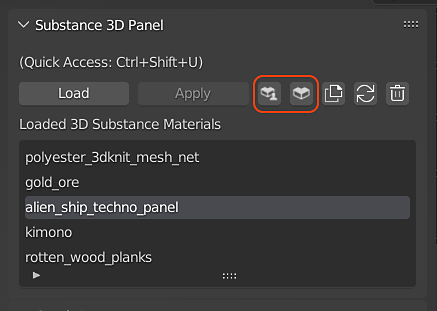

# Substance 3D Assets 라이브러리

수천 개에 이르는 전문적으로 제작된 자료와 기타 에셋을 [Substance 3D Assets 페이지](https://helpx.adobe.com/kr/substance-3d/unlisted/assets.html)에서 다운로드할 수 있습니다. 커뮤니티에서 무료로 공유한 더 많은 에셋은 [Substance 3D 커뮤니티 에셋 페이지](https://helpx.adobe.com/kr/substance-3d/unlisted/community-assets.html)에서 찾을 수 있습니다.

Blender 내의 Substance 3D 패널에서 Substance 3D Assets 및 Substance 3D Community Assets 버튼을 클릭하여 해당 페이지에 대한 웹 브라우저를 열 수도 있습니다.

