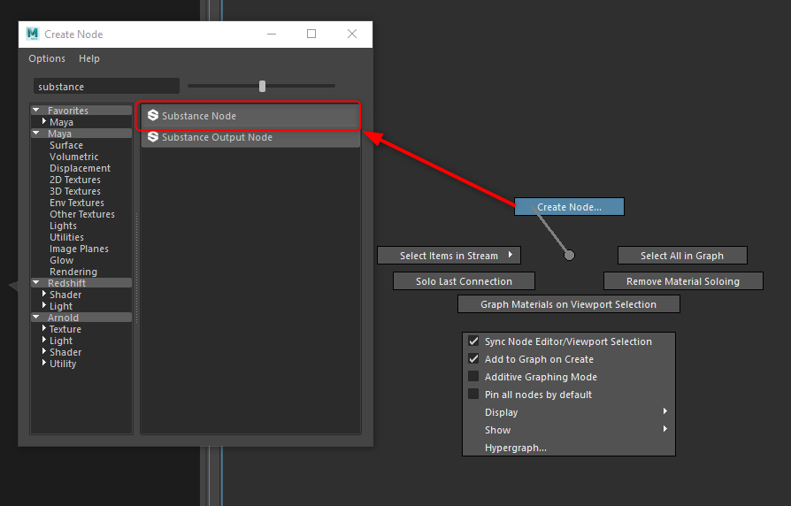

# Maya Substance 개요

## 플러그인 개요

[Substance] 플러그인을 사용하면 Maya에서 Substance Designer으로 만든 Substance 재질을 직접 로드할 수 있습니다. 플러그인은 Maya 재질을 만들고 Substance 텍스처를 재질 채널 입력에 공급합니다. 그런 다음 Substance 매개 변수를 변경할 수 있고 텍스처가 자동으로 업데이트됩니다.

>[!NOTE]
>
> [설정/환경 설정] ->Maya 플러그인 관리자에 플러그인이 로드되어 있는지 확인합니다

## Substance 열기

1. Hypershade를 열고 노드 편집기에서 마우스 오른쪽 버튼을 클릭한 후 표시 메뉴에서 위로 쓸어 넘겨 노드 만들기를 선택합니다. 그러면 노드 작성 창이 열립니다. 여기에서 Substance 노드를 검색할 수 있습니다.

   

   노드 편집기에서 tab 키를 누르고 텍스트 필드에 substance 를 입력하면 substance 옵션이 필터링됩니다. 옵션에서 Substance 텍스처 를 선택합니다.
1. Substance 노드를 선택하고 속성 편집기에서 Substance(.sbsar) 파일을 찾습니다.

   
1. Substance에 여러 그래프가 포함된 경우 선택한 그래프 드롭다운이 채워집니다. 선택한 그래프는 재질을 만드는 데 사용됩니다.
1. [그래프 정보] 버튼에는 Substance Designer으로 설정된 그래프 속성이 표시됩니다.
1. 너비 및 Height 드롭다운 상자에서 값을 선택하여 해상도를 설정합니다. 비율 잠금(Lock Ration)은 기본적으로 활성화됩니다.
1. Arnold 등의 렌더러에서 사용할 수 있도록 Substance 출력을 디스크로 구우려면 출력을 디스크로 캐시 를 활성화하십시오. 캐시된 파일은 Maya 파일 노드를 사용하여 플러그인에서 다시 읽습니다.

   
1. 사용 중인 렌더러의 워크플로우를 선택하고 [셰이더 네트워크 만들기] 버튼을 클릭합니다. 렌더러 워크플로에 대해 셰이더 네트워크가 만들어집니다. 이제 장면에 재질을 적용할 수 있습니다.

   {width="1000px"}
