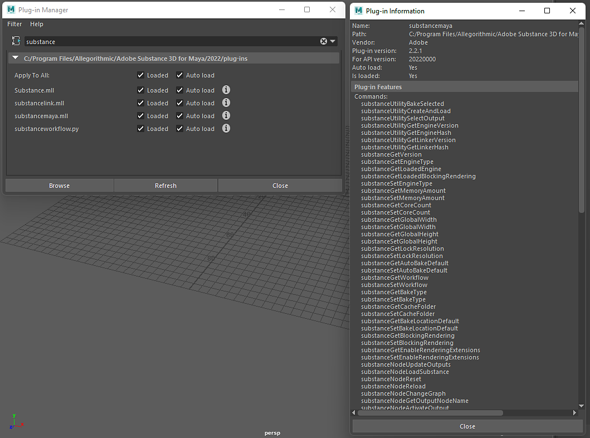

# Maya 스크립팅

Maya 플러그인의 Substance은 스크립팅할 수 있습니다. 노출된 API를 사용하면 Substance 명령을 스크립트에서 사용하여 Substance 자료를 만들고 관리할 수 있습니다. 플러그인 정보로 이동하여 사용 가능한 명령에 액세스할 수 있습니다.

***Windows>Settings/Preferences/Plugin Manager를 선택하고 substancemaya.mll 파일을 검색하십시오.***

&quot;i&quot; 단추를 클릭하여 사용 가능한 명령을 확인합니다



## 예제 스크립트:

이 스크립트는 sbsar 파일을 로드하고 선택한 메시에 아놀드 렌더링 작업 과정을 적용합니다. 스크립트를 사용하려면 여기에 나열된 예를 따르십시오.

1. 코드를 복사하여 스크립트 편집기의 Python 탭에 붙여넣습니다.
1. 뷰포트에서 선택 및 메시
1. Python 탭에서 텍스트를 선택하고 &quot;ctrl + enter&quot;를 누릅니다.
1. 창에서 sbsar 파일을 찾습니다.

```
import maya.cmds as cmds 

 

def _connect_place2d(substance_node): 

    """ Connects the place2d texture node to the Substance node """ 

    place_node = cmds.shadingNode('place2dTexture', asUtility=True) 

 

    connect_attrs = [('outUV', 'uvCoord'), ('outUvFilterSize', 'uvFilterSize')] 

 

    for out_attr, in_attr in connect_attrs: 

        cmds.connectAttr('{}.{}'.format(place_node, out_attr), 

                         '{}.{}'.format(substance_node, in_attr)) 

 

def _find_shading_group(node): 

    """ Walks the shader graph to find the shading group """ 

    result = None 

 

    connections = cmds.listConnections(node, source=False) 

 

    if connections: 

        for connection in connections: 

            if cmds.nodeType(connection) == 'shadingEngine': 

                result = connection 

            else: 

                result = _find_shading_group(connection) 

                if result is not None: 

                    break 

 

    return result 

 

def _apply_substance_workflow_to_selected(substance_file, workflow): 

    """ Imports a mesh into Maya and applies the shader from a 

        Substance workflow to it """ 

    geometry = cmds.ls(geometry=True) 

 

## Create the substance node and connect the place2d texture node

    substance_node = cmds.shadingNode('substanceNode', asTexture=True) 

    _connect_place2d(substance_node) 

 

## Load the Substance file

    cmds.substanceNodeLoadSubstance(substance_node, substance_file) 

 

## Apply the workflow

    cmds.substanceNodeApplyWorkflow(substance_node, workflow=workflow) 

 

## Acquire the shading group and apply it to the mesh

    shading_group = _find_shading_group(substance_node) 

 

    cmds.select(geometry) 

    cmds.hyperShade(assign=shading_group) 

 

def demo_load_sbsar_workflow(): 

    """ Acquires an sbsar from a file dialog, loading and applying it to 

        any selected mesh """ 

    file_filter = 'Substance (*.sbsar);;' 

 

    files = cmds.fileDialog2(cap='Select a Substance file', fm=1, dialogStyle=2, 

                             okc='Open', fileFilter=file_filter) 

 

    if files: 

        substance_file = files[0] 

        _apply_substance_workflow_to_selected(substance_file, 

                                              cmds.substanceGetWorkflow()) 

 

if __name__ == '__main__': 

    demo_load_sbsar_workflow()
```


노출된 API를 사용하면 스크립트에서 Substance 명령을 사용할 수 있습니다
