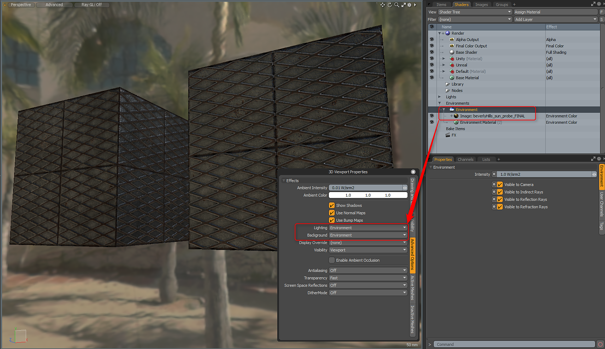

# 환경 및 렌더링 설정

## 환경 설정 및 렌더링

물리적 기반 렌더링 및 고급 뷰포트 설정으로 최상의 결과를 얻으려면 환경에서 HDR 맵을 사용해야 합니다. MODO는 [레이아웃] 탭에서 찾을 수 있는 여러 가지 환경 사전 설정을 제공합니다.\
HDR 환경을 로드한 후에는 고급 뷰포트 조명 및 배경 옵션을 설정해야 합니다. O 키를 눌러 3D 뷰포트 속성을 표시하고 고급 옵션에서\
조명 및 환경에 환경 옵션. 또는 장면 조명이 있는 경우 조명에 장면 + 환경 을 사용할 수 있습니다.

## 중요도 샘플링

Substance Designer 3D 뷰포트는 중요도 샘플링을 사용합니다. 렌더링 시 최상의 결과를 얻으려면 MODO 렌더러에 대해 중요도 샘플링을 활성화해야 합니다. 렌더링 설정의 전역 조명 탭에서 이 작업을 수행할 수 있습니다.

