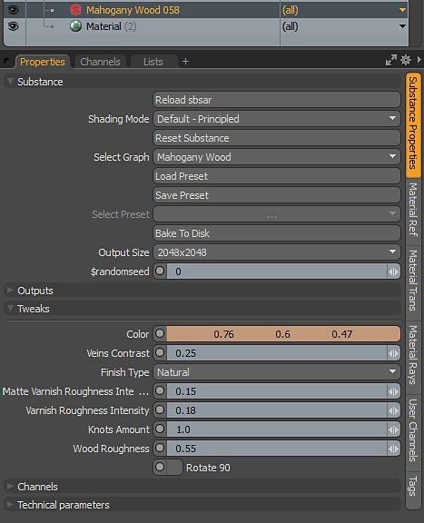

# MODO 개요의 Substance

## 개요:

## Substance 열기

1. 재질을 생성하거나 재질 그룹을 선택합니다.
1. [텍스처] > [Substance]에서 [Substance 만들기]를 선택하거나 [Substance 키트] 옵션 아래의 [만들기] 단추를 사용합니다. 이렇게 하면 셰이더 트리에 Substance 재질이 만들어집니다.
1. [sbsar 불러오기]를 클릭하여 sbsar 파일을 불러옵니다.

   

## 출력 만들기

**기본 - 원점 음영 모드**&#x200B;를 사용하면 금속성/거칠기 워크플로우를 사용하여 출력을 만들 수 있습니다.

1. [Substance 속성]의 [출력] 섹션에서 음영에 필요한 출력을 클릭합니다. Substance 텍스처가 생성되고 올바른 재질 레이어 효과를 사용하여 셰이더 트리에 추가됩니다. Principled 음영 모드의 경우 다음이 필요합니다.

   | Substance 출력 | 색상 공간 | 재질 레이어 효과(원점 음영 모드) |
   | --- | --- | --- |
   | 기본 색상 | sRGB | 색상 확산 |
   | 표준 | 선형 | 표준 |
   | 거칠기 | 선형 | 거칠기 |
   | 금속재질 | 선형 | 금속재질 |

   

## 해상도/매개변수 변경

Substance 매개변수를 변경하여 생성된 텍스처를 업데이트하거나 변경할 수 있습니다. 매개 변수를 변경하면 Substance 엔진이 MODO 재질에 전달된 텍스처를 다시 계산합니다.

1. Substance 재질에 대한 Substance 속성으로 이동하고 비틀기 섹션에서 매개 변수를 변경합니다.

   
1. 출력 크기 드롭다운 메뉴를 사용하여 생성된 텍스처의 해상도를 변경할 수 있습니다. Substance은 최대 8K까지 생성하도록 설정할 수 있습니다. 8K 출력에는 [Substance GPU 엔진](../../../3d-applications/modo/modo-switch-engine/modo-switch-engine.md)이 필요합니다.
