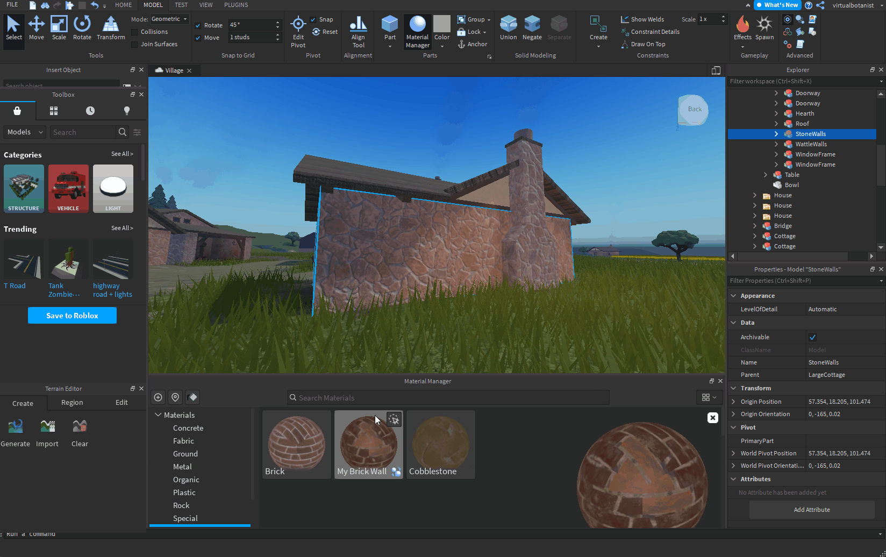

# Roblox

[Roblox](https://www.roblox.com/)은 몰입형 3D 멀티플레이어 경험을 위한 플랫폼입니다. Roblox Studio는 Roblox 디자인 도구로 PBR 금속 거칠기 워크플로우를 지원합니다.

<table>
<tr style="border: 0;">
<td width="58.30%" style="border: 0;" valign="top">

## Substance 3D Designer 템플릿

Roblox용 텍스처를 만들려면 아래의 Substance 3D 파일을 [Substance 3D Designer](https://experienceleague.adobe.com/en/docs/substance-3d-designer/home)에서 [Substance 합성 그래프](https://experienceleague.adobe.com/en/docs/substance-3d-designer/using/substance-graphs/substance-compositing-graphs) 템플릿으로 사용할 수 있습니다.

[roblox 템플릿에 연결된 sbs 파일 형식 아이콘의 {width="64px"}](https://helpx.adobe.com/content/dam/roblox.sbs)

이 그래프 템플릿을 사용하면 최종 텍스처 파일 이름 및 유형을 사전 구성할 수 있습니다. 이 템플릿을 설치하여 항상 Roblox 재질 지침을 따르는 새 재질을 만드는 데 다시 사용할 수 있습니다.

</td>
<td width="41.60%" style="border: 0;" valign="top">

{width="200px"}

</td>
</tr>
</table>

## Designer에서 Roblox로의 워크플로

<table>
<tr style="border: 0;">
<td style="border: 0;" valign="top">

### 템플릿 설치

먼저 Roblox 템플릿을 *설치*&#x200B;합니다.

* 위에서 연결된 템플릿 파일을 다운로드합니다.
* Designer의 사용자 문서 디렉토리로 이동합니다.
* (Creative Cloud 데스크톱) `/Documents/Adobe/Adobe Substance 3D Designer`\
  (스팀) `/Documents/Allegorithmic/Substance Designer/`
* 템플릿 폴더를 만듭니다.
* 파일을 해당 폴더에 배치합니다.

</td>
<td style="border: 0;" valign="top">

{width="512px"}

</td>
</tr>
</table>

<table>
<tr style="border: 0;">
<td style="border: 0;" valign="top">

### 템플릿 검색

그런 다음 Designer에서 템플릿 폴더를 *감시*&#x200B;하여 그래프 템플릿을 찾도록 하세요.

* Designer에서 **편집 > 환경 설정...**(으)로 이동합니다.
* [환경 설정](https://experienceleague.adobe.com/en/docs/substance-3d-designer/using/workspace/preferences/preferences-window) 창에서 **프로젝트 > 사용자 프로젝트 > 일반**(으)로 이동
* **템플릿 디렉터리** 목록에서 **+** 단추를 클릭합니다.
* `templates` 디렉터리로 이동하여 **폴더 선택**&#x200B;을 클릭합니다.
* **확인** 단추를 클릭합니다.
* **파일 > 새로 만들기 > Substance 그래프...**(으)로 이동
* [새 Substance 그래프](https://helpx.adobe.com/substance-3d/unlisted/documentation/sddoc/create-a-graph-102400068.html) 창에서 `Roblox` 템플릿이 템플릿 목록의 맨 아래에 나열되어 있는지 확인합니다

</td>
<td style="border: 0;" valign="top">

{width="512px"}

</td>
</tr>
</table>

<table>
<tr style="border: 0;">
<td style="border: 0;" valign="top">

### 텍스처 내보내기

Roblox 템플릿을 사용하여 그래프를 만들고 재료 작업이 완료되면 그래프에서 비트맵을 내보냅니다.

* [새 Substance 그래프](https://helpx.adobe.com/substance-3d/unlisted/documentation/sddoc/create-a-graph-102400068.html) 창에서 `Roblox` 템플릿을 선택합니다
* 그래프의 식별자 및 기타 매개 변수를 설정하고 **확인**&#x200B;을 클릭하세요.
* [그래프 보기](https://experienceleague.adobe.com/en/docs/substance-3d-designer/using/workspace/graph-view/the-graph-view)에서 재질 작업 - 작업 과정을 시작하려면 [여기](https://experienceleague.adobe.com/en/docs/substance-3d-designer/using/getting-started/workflow-overview)를 참조하세요
* 완료되면 그래프 보기 *도구 모음*&#x200B;에서 **도구 > 비트맵 내보내기...**(으)로 이동합니다.
* [비트맵 내보내기](https://experienceleague.adobe.com/en/docs/substance-3d-designer/using/substance-graphs/exporting-bitmaps) 창에서 올바른 **대상** 경로를 설정하고 *모든* 출력이 *체크 표시*&#x200B;되었는지 확인한 다음 **내보내기**&#x200B;를 클릭하세요.
* 텍스처가 **대상** 경로로 올바르게 내보내졌는지 확인하세요.

</td>
<td style="border: 0;" valign="top">

{width="512px"}

</td>
</tr>
</table>

<table>
<tr style="border: 0;">
<td style="border: 0;" valign="top">

### Roblox에서 재질 만들기

Roblox에서 재질 변형을 만들고 Designer에서 내보낸 텍스처를 할당합니다.

* **모델** 탭을 선택하고 **재질 관리자**&#x200B;를 클릭합니다.
* *재질 템플릿*&#x200B;을 선택하고 **변형 만들기** 단추를 클릭합니다.
* **변형 만들기** 창에서 재질의 이름을 설정합니다
* *각 재질 텍스처*&#x200B;에 대해 **가져오기** 단추를 클릭하고 Designer에서 내보낸 해당 채널을 선택합니다
* **저장**&#x200B;을 클릭합니다.

</td>
<td style="border: 0;" valign="top">

{width="512px"}

</td>
</tr>
</table>

<table>
<tr style="border: 0;">
<td style="border: 0;" valign="top">

### 재질 적용

Roblox 장면에서 새로운 재질 변형 사용

* Roblox 장면에서 모든 부분 또는 메시 *선택*
* **재질 관리자**&#x200B;에서 *재질 변형*&#x200B;을 선택하고 **선택한 부품에 적용** 단추를 클릭합니다.

>[!NOTE]
>
> Roblox에서 텍스처의 색상이 다르게 보이는 경우 재질 변형이 적용된 개체 속성에서 **모양** 범주 아래의 **색상** 특성을 확인하고 Roblox에서 *제도적 흰색*&#x200B;으로 레이블이 지정된 *순수 흰색*(즉, RGB(255, 255, 255))으로 설정되어 있는지 확인합니다.

</td>
<td style="border: 0;" valign="top">

{width="512px"}

</td>
</tr>
</table>

<table>
<tr style="border: 0;">
<td style="border: 0;" valign="top">

### 타일링 조정

표면 상의 재료의 반복의 양, 즉 타일링(tiling)은 언제든지 조정될 수 있다.

* **재질 관리자**&#x200B;에서 *재질 변형*&#x200B;을 선택하고 **편집** 단추를 클릭합니다.
* **변형 편집** 창에서 **추가** 아래의 **타일당 스터드** 속성 값을 조정합니다. *더 낮음* 값은 *더 많음*&#x200B;의 반복을 초래합니다.

</td>
<td style="border: 0;" valign="top">

{width="512px"}

</td>
</tr>
</table>
