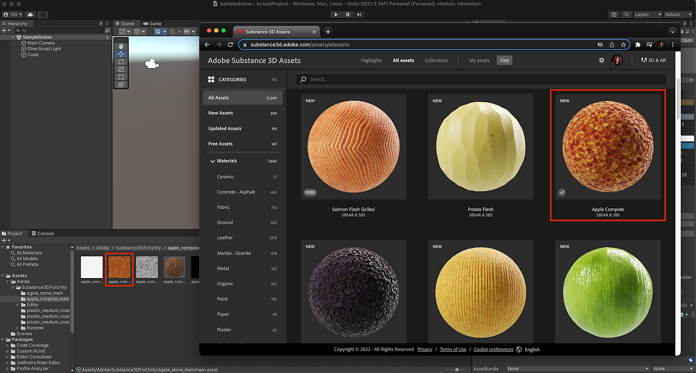

# Substance 3D Assets 라이브러리 사용

[Substance 3D 에셋 라이브러리](https://helpx.adobe.com/kr/substance-3d/unlisted/assets.html)에서 사전 설정을 사용하여 1,000개 이상의 고품질 편집 및 내보내기 준비가 가능한 4K 자료에 액세스하세요. [커뮤니티 에셋 라이브러리](https://helpx.adobe.com/kr/substance-3d/unlisted/community-assets.html)에서 커뮤니티가 제공한 에셋을 탐색할 수 있습니다.

에셋 라이브러리에서 재질을 다운로드하고 Unity에서 사용할 수 있습니다.

