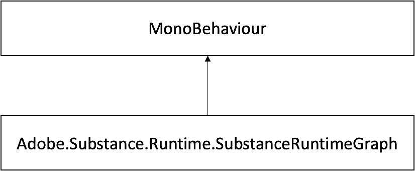

# SubstanceRuntimeGraph 클래스

## Adobe.Substance.런타임.SubstanceRuntimeGraph 클래스 참조

Substance 그래프에서 입력을 수정하고 렌더링하는 런타임 기능을 제공하여 ←GraphSO가 런타임에 자산을 생성할 수 있도록 하는 클래스입니다.

Adobe.Substance.Runtime.SubstanceRuntimeGraph의 상속 다이어그램:



### 공용 멤버 함수

```
• void AttachGraph (SubstanceGraphSO graph)
```


이 런타임 처리기에 새 그래프 개체를 첨부합니다.

```
• void SetInputFloat (string inputName, float value)
```


Substance 부동 입력 업데이트

```
• float GetInputFloat (string inputName)
```


Substance 부동 입력 가져오기

```
• void SetInputVector2 (string inputName, Vector2 value)
```


Substance Vector2 입력 업데이트

```
• Vector2 GetInputVector2 (string inputName)
```


Vector2 Substance 입력 가져오기

```
• void SetInputVector3 (string inputName, Vector3 value)
```


Substance Vector3 입력 업데이트

```
• Vector3 GetInputVector3 (string inputName)
```


Substance Vector3 입력을 가져옵니다.

```
• void SetInputVector4 (string inputName, Vector4 value)
```


Substance Vector4 입력 업데이트

```
• Vector4 GetInputVector4 (string inputName)
```


Substance Vector4 입력 가져오기

```
• void SetInputColor (string inputName, Color value)
```


Substance 색상 입력 업데이트

```
• Color GetInputColor (string inputName)
```


Substance 색상 가져오기

```
• void SetInputBool (string inputName, bool value)
```


Substance 부울 입력 업데이트

```
• bool GetInputBool (string inputName)
```


Substance 부울 입력을 가져옵니다.

```
• void SetInputInt (string inputName, int value)
```


Substance Int 입력 업데이트

```
• int GetInputInt (string inputName)
```


Substance Int 입력 가져오기

```
• void SetInputVector2Int (string inputName, Vector2Int value)
```


Substance Vector2Int 입력을 업데이트합니다.

```
• Vector2Int GetInputVector2Int (string inputName)
```


2 int의 배열을 가져옵니다.

```
• void SetInputVector3Int (string inputName, Vector3Int value)
```


Substance Vector3Int 입력을 업데이트합니다.

```
• Vector3Int GetInputVector3Int (string inputName)
```


3 int의 배열 가져오기(Vector3Int의 x, y 및 z 값)

```
• void SetInputVector4Int (string inputName, int x, int y, int z, int w)
```


Substance Vector4Int 입력 업데이트

```
• int[ ] GetInputVector4Int (string inputName)
```


4 int의 배열 가져오기(Vector4Int의 x, y, z 및 w 값)

```
• void SetInputString (string inputName, string value)
```


Substance 문자열 입력을 업데이트합니다.

```
• string GetInputString (string inputName)
```


Substance 문자열 입력을 가져옵니다.

```
• SubstanceInputDescription GetInputDescription (string inputName)
```


대상 입력 이름에 대한 전체 입력 설명을 반환합니다.

```
• void SetInputTexture (string inputName, Texture2D value)
```


Substance 텍스처 2D 입력을 업데이트합니다.

```
• Vector2Int GetTexturesResolution ()
```


인스턴스 텍스처 출력 해상도를 반환합니다.

```
• void SetTexturesResolution (Vector2Int size)
```


인스턴스 텍스처 출력 해상도를 설정합니다.

```
• bool HasInput (string inputName)
```


이 substance 인스턴스에 지정된 이름의 입력이 있는 경우 true를 반환합니다.

```
• List< Texture2D > GetGeneratedTextures ()
```


Substance 인스턴스에 대한 모든 출력 텍스처가 있는 목록을 반환합니다.

```
•  Texture2D GetOutputTexture (string outputName)
```


지정된 출력 이름에 대한 출력 텍스처를 반환합니다.

```
• void Render ()
```


Substance 인스턴스를 동기적으로 렌더링합니다.

```
• Task RenderAsync ()
```


Substance 인스턴스를 비동기적으로 렌더링합니다.

```
• void LoadPreset (string presetXML)
```


사전 설정 XML을 사용하여 그래프 입력 매개 변수를 설정합니다.

```
• string CreatePresetFromCurrentState ()
```


현재 그래프 상태를 사전 설정 XML에 저장합니다.

## 공용 속성

```
• SubstanceGraphSO GraphSO
```


대상 물질 인스턴스입니다.

## 보호된 멤버 함수

```
• void Awake ()
```


On awake SubstanceRuntime은 Substance에서 연결된 SubstanceGraphSO의 인스턴스를 만드는 데 사용됩니다.

SDK.

```
• void Update ()
```


렌더링 결과에 대해 렌더링 ConcurrentQueue를 확인합니다.

```
• void OnDestroy ()
```


Substance SDK 처리기를 삭제합니다.

## 속성

```
• Material DefaulMaterial [get]
```


Substance 인스턴스에서 생성한 기본 재질입니다.
