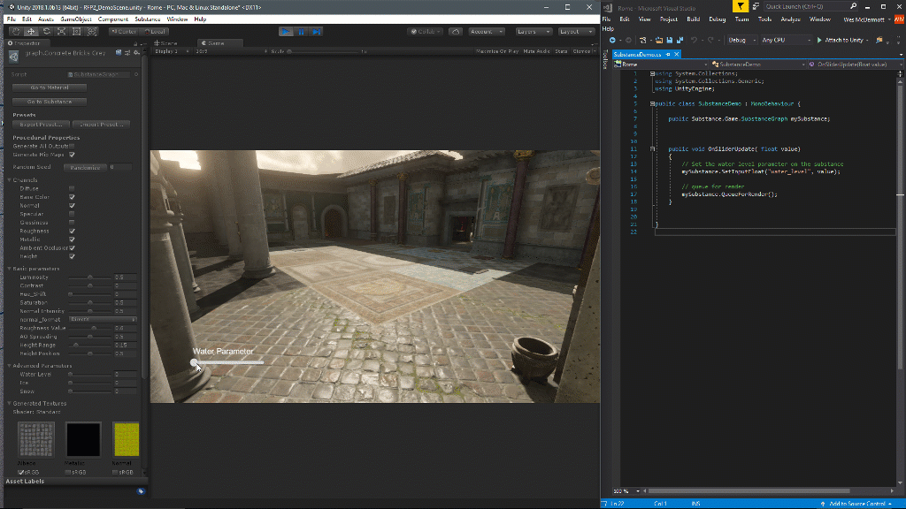

# API 개요

## Substance.게임

```
Using Substance.Game
```


Substance.Game은 스크립팅에 사용되는 클래스가 포함된 어셈블리입니다. 이러한 클래스는 다음과 같습니다.

**Substance.Game.**&#x200B;**Substance**: sbsar 참조

**Substance.Game.SubstanceGraph**: sbsar의 개별 그래프&#x200B;*(Unity 2017에서 ProceduralMaterial로 사용됨)*

## 스크립팅 프로세스

1. SubstanceGraph의 인스턴스 만들기
1. 그래프 인스턴스에서 매개 변수를 설정합니다.
1. 렌더링 Substance 대기열 만들기: QueueForRender()이 Substance 그래프를 대기열에 추가합니다. 이 목록은 다음 RenderAsync 또는 RenderSync 호출로 처리됩니다.

### 그래프 인스턴스 매개변수

```
// panel color 

mySubstance.SetInputColor("paint_color", color); 

 

// panel size 

mySubstance.SetInputVector2("square_open", panelSize); 

 

// wear level 

mySubstance.SetInputFloat("wear_level", wearLevel);
```


따옴표 안의 값은 Substance Designer으로 설정된 매개 변수 식별자입니다.

[유니티 관리자]에서 매개 변수 위에 마우스를 놓으면 Substance Designer에 설정된 식별자의 이름을 표시하는 도구 설명이 표시됩니다.


### 렌더링할 Substance 대기열에 추가

```
// queue the substance to render 

mySubstance.QueueForRender(); 

 

//render all substances async 

Substance.Game.Substance.RenderAsync();
```




>[!NOTE]
>
> 현재 x86\_64 아키텍처만 지원합니다. 빌드 설정에서 x86\_64를 설정해야 합니다.


