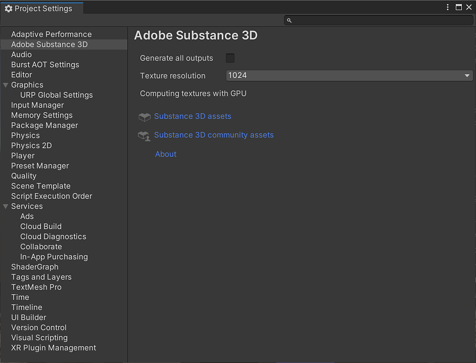

# Unity 환경 설정

Adobe Substance 3D 환경 설정 창에서 플러그인에 대한 사용자 정의 옵션을 설정할 수 있습니다.

**모든 그래프 출력 생성** - 항상 그래프당 모든 그래프 출력을 생성합니다.

**텍스처 해상도** - 그래프당 생성된 텍스처의 기본 해상도

**CPU 최대 해상도** - CPU 엔진을 사용할 때 지원되는 최대 텍스처 해상도입니다.

**Substance 3D 에셋** - Substance 3D Assets 페이지에 연결.

**3d 커뮤니티 에셋 Substance** - Substance 3D 커뮤니티 에셋 페이지에 연결.

**정보** - 플러그인 버전 정보를 표시합니다.

