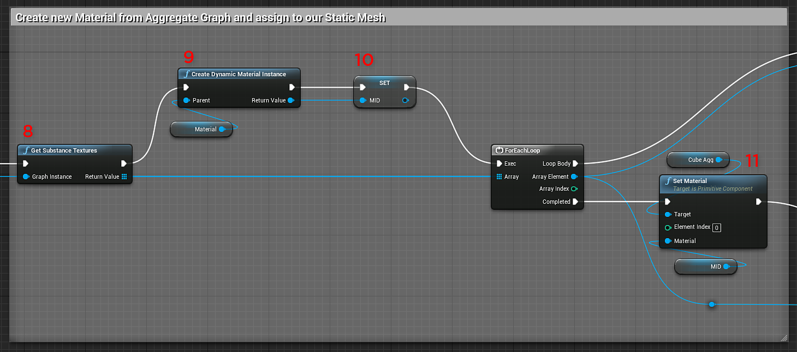

# 청사진(UE4): 집계 Substance

새 집계 Substance 노드를 사용하면 두 개의 Substance 인스턴스 팩터리를 가져와 런타임에 새 인스턴스 팩터리를 만들 수 있습니다. 이 팩터리는 새 그래프 인스턴스를 만드는 데 사용할 수 있습니다. 이렇게 하면 결합된 그래프 인스턴스 중 하나의 출력 텍스처를 다른 결합된 그래프 인스턴스의 입력 이미지에 연결할 수 있다는 점이 특별해집니다. 이 새 팩터리에서 Substance Graph 인스턴스를 만들려면 런타임 그래프 인스턴스에 대한 설명서를 참조하십시오. [재질 인스턴스 정의 - UE4](https://helpx.adobe.com/substance-3d/unlisted/documentation/integrations/material-instance-definition-157352129.html)

1. 사용할 Substance을 가져옵니다.
1. **Substance 그래프 인스턴스** 형식의 &quot;AggregateGraphInstance&quot; 변수를 만듭니다.
1. **재질** 및 **재질 인스턴스 동적** 유형의 변수 만들기
1. **Substance 연결 만들기**&#x200B;를 만들고 출력 및 입력 식별자를 설정합니다.
1. **집계 Substance 인스턴스 팩터리**&#x200B;를 만들고 출력 및 입력 팩터리를 설정합니다.
1. **그래프 인스턴스**&#x200B;를 만들고 인스턴스 이름을 설정하십시오.
1. **집계 그래프 인스턴스** 변수를 설정합니다.
1. **Substance 텍스처 가져오기**&#x200B;를 사용하여 7단계의 집계 그래프 인스턴스에서 Substance 텍스처를 가져옵니다.
1. 3단계의 재질 변수를 부모로 사용하여 **동적 재질 인스턴스**&#x200B;를 만듭니다.
1. 3단계의 MID 변수를 설정합니다.
1. MID 변수와 함께 **재질 설정**&#x200B;을 사용하여 메시의 재질을 설정합니다.

   {width="800px"}
1. 동적 재질 인스턴스 문서에 표시된 대로 재질에 대한 채널을 설정합니다(11~19단계).\
   [청사진(UE4): 동적 재질 인스턴스](https://helpx.adobe.com/substance-3d/unlisted/documentation/integrations/blueprint-dynamic-material-instance-152535142.html)

   {width="800px"}
