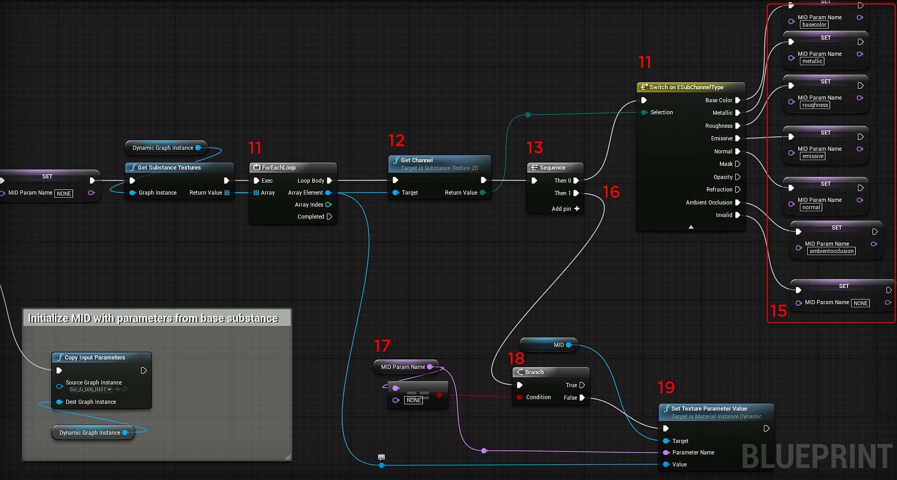

# 청사진(UE4): 동적 재질 인스턴스

Substance 그래프 인스턴스를 만들어 런타임에 동적 그래프 인스턴스를 만들 수 있습니다.

1. Instance Factory 유형의 변수를 만들고 기본값을 Imported Instance Factory로 설정합니다.
1. Create Graph Instance 노드를 추가하고 Instance Factory Substance을 Factory 입력에 연결합니다. 인스턴스 이름을 설정합니다.
1. Substance 인스턴스 팩터리 유형의 다른 변수를 만듭니다. 그러면 동적 Substance 재질에 대한 참조가 유지됩니다.
1. 그래프 인스턴스 생성 노드의 반환 값을 사용하여 동적 Substance 재질에 대한 변수를 설정합니다.
1. 재료(Material) 유형의 변수를 생성합니다. 재료 템플릿이 됩니다. [내용 브라우저]에서 Substance이 생성한 UE4 자료를 복제합니다. 이 복제된 재질을 재료 템플릿 변수에 대한 입력으로 설정합니다.
1. 동적 재질 인스턴스 생성 을 추가하고 재질 템플릿 변수를 상위로 설정합니다.

   {width="800px"}
1. 재료(Material) 유형의 변수를 생성합니다. 자재 인스턴스 동적(MID)입니다. Dynamic Material 인스턴스의 반환 값을 변수로 설정합니다.

   {width="800px"}
1. Set Material Node를 추가하고 MID 변수의 값을 Material Input으로 설정합니다. 대상에 대해 재질을 적용할 개체로 설정합니다.
1. Name 유형의 변수를 만듭니다. 이 변수는 재질에 설정된 채널의 이름을 보유합니다. 값을 &quot;NONE&quot;으로 초기화합니다.
1. Substance 텍스처 가져오기 노드를 추가하고 그래프 인스턴스를 동적 그래프 인스턴스 변수로 설정합니다.
1. For 루프 노드를 추가합니다. 여기에서 Substance 텍스처를 반복합니다. Substance 가져오기 텍스처의 결과를 입력 배열로 가져옵니다.

   {width="800px"}
1. for 루프의 배열 요소를 입력으로 사용하여 Substance Get Channel 노드를 추가합니다.
1. 시퀀스 노드를 추가합니다. 먼저 Get Channel 노드의 결과를 실행합니다.
1. Get Channel 반환 값을 선택 항목으로 하여 Sequence Then 0 뒤에 ESubChannelType 스위치를 추가합니다. 여기서 우리는 채널 이름을 확인합니다.
1. 5단계에서 복제된 Substance 자료에 있는 채널 이름으로 MID Name 변수를 설정합니다. *재질 이미지를 봅니다.*
1. 시퀀스 노드 Then 1에서 동적 재료에 채널명을 지정하는 프로세스를 설정합니다.
1. MID 이름 변수를 가져와 값이 &quot;NONE&quot;인 동일한 문자열 노드를 추가합니다. 이 값은 변수를 초기화합니다.
1. 같음 노드의 조건을 사용하여 분기 노드를 추가합니다.
1. Substance 집합 텍스처 매개 변수 값을 추가합니다. 대상은 MID 변수이고 매개변수 이름은 MID name 변수이다. 값은 ForEachLoop 노드의 배열 요소입니다.

{width="800px"}
