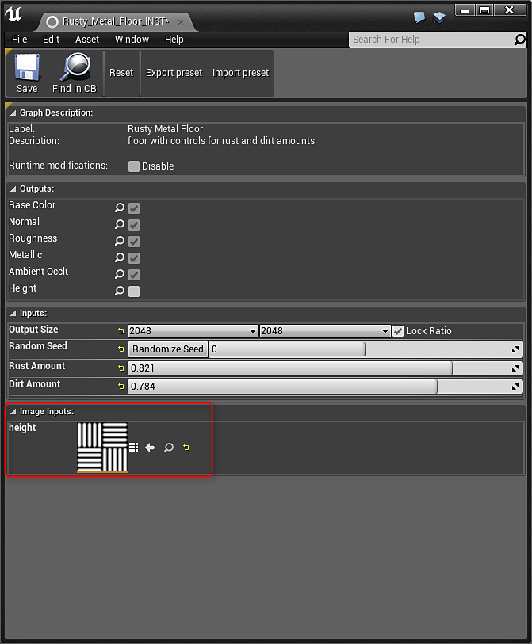

# Substance 입력 이미지 - UE4

Substance은 자재에서 처리할 이미지를 제공할 수 있는 입력으로 생성할 수 있습니다. 이를 통해 구운 메시 데이터나 패턴을 입력으로 받아 재질을 변경하거나 자산에 맞출 수 있는 모듈식 재질을 만들 수 있습니다. 질감을 substance 입력으로 사용하려면, Substance 입력 질감으로 UE4에 가져와야 합니다.

1. [콘텐츠 브라우저]로 텍스처를 가져옵니다. 형식에서 Substance 이미지 입력(jpg, tga, jpeg) 을 선택합니다.
1. 이제 이 텍스처를 Substance 입력과 함께 사용할 수 있습니다.

{width="600px"}{width="600px"}
