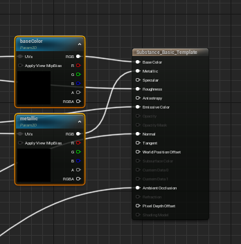

# 재료 템플릿 사용 - UE5

재료 템플릿을 사용하면 출력 노드를 재료의 입력에 연결하기 위한 템플릿으로 사용할 재료 기본 재질을 만들 수 있습니다.\
재료 입력과 동일한 이름 및 유형을 공유하는 출력이 자동으로 사용됩니다. 이 상위 재질 예에는 &quot;baseColor&quot;라는 텍스처 출력이 있는 Substance의 경우 채워질 &quot;baseColor&quot; 텍스처 샘플 노드가 있습니다.\

Substance 출력은 텍스처, 단일 부동 소수점 또는 int 스칼라 값, 벡터(2~4) 값 업데이트를 지원합니다. 런타임에 float 또는 int 출력을 사용하려면 그래프에서 dynamicMaterialInstance를 constantMaterialInstances(편집기에서 생성된 모든 재질)로 가져와야 런타임에 스칼라 값을 변경할 수 없습니다.

Substance Graph 인스턴스는 생성 시 모든 관련 출력 값을 채우려고 시도합니다.

