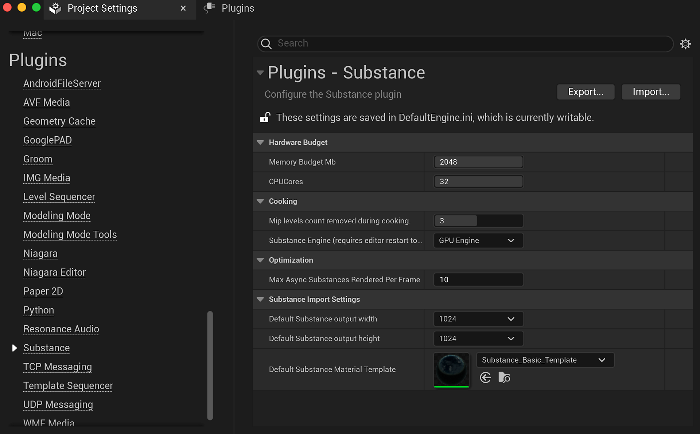

# 플러그인 설정 - UE5

설정에 액세스하려면 편집>프로젝트 설정으로 이동하고 Substance 범주로 스크롤하여 플러그인을 클릭합니다.

## 하드웨어 예산

메모리 예산은 Substance 엔진에 사용할 최대 메모리 양입니다. Substance 처리 속도를 높이기 위해 늘릴 수 있지만 시스템 리소스를 더 많이 소비합니다. ( 프로젝트 수준에서 증가하면 항상 도움이 되는 것은 아닙니다.)

CPU 코어는 Substance 엔진에서 사용할 수 있는 코어 수를 결정합니다. 여기에는 물리적 코어와 하이퍼 스레드가 모두 포함됩니다. 할당된 수가 시스템에서 사용 가능한 코어보다 크면 기본적으로 사용 가능한 모든 코어를 사용합니다.

## 요리

요리하는 동안 제거된 Mip 레벨 수는 패키지에 대한 텍스처가 생성되는 방법을 변경합니다. 이 설정은 더 큰 텍스처 mip 수준을 더 이상 로드할 필요가 없으므로 로드 시간을 크게 개선하고 패키지 크기를 줄일 수 있습니다. 낮은 해상도/작은 LOD가 로드되고 가장 높은 해상도는 UE5에 의해 기본값으로 설정됩니다. 그런 다음 Substance은 Substance 엔진을 통해 처리되고 고해상도 LOD로 런타임에 업데이트됩니다.

Substance 엔진은 CPU 또는 GPU일 수 있습니다. GPU 엔진을 사용하여 4K 텍스처를 만들 수 있습니다. CPU 엔진이 2K로 제한됩니다.

## 최적화:

이렇게 하면 각 일괄 처리에 대해 Substance 엔진에 전달할 수 있는 비동기 물질의 수가 제한됩니다. 숫자가 낮을수록 비동기 작업이 완료되는 속도가 빨라지고 숫자가 높을수록 한 번에 여러 Substance을 일괄 렌더링하고 처리하는 업데이트 속도가 높아집니다. 값이 높을수록 업데이트 사이의 시간이 길어져 텍스처 업데이트가 고르지 않게 됩니다.

## 비동기/동기화 렌더링

동기화 렌더링은 차단 렌더링 호출입니다. 이렇게 하면 Substance 그래프 인스턴스가 다시 계산할 Substance 엔진에 전달되지만 Substance 엔진이 Substance 처리를 마칠 때까지 실행을 중지한 후 더 이상 코드 실행을 계속합니다. 프로세스가 완료되는 즉시 화면에 결과도 업데이트됩니다.

Async는 Substance 업데이트 내에서 그래프를 대기열에 추가하고 여러 그래프를 Substance 엔진으로 한 번에 전송합니다(플러그인 설정 내에서 설정). 동기화 렌더링과 달리 프로그램은 Substance 엔진이 완료될 때까지 대기하지 않고 전송되면 평소처럼 계속 실행됩니다. Substance 엔진이 일괄 처리를 완료하면 결과를 다시 전송하고, 이를 출력에 적용하고, 또 다른 일괄 처리를 시작합니다.
