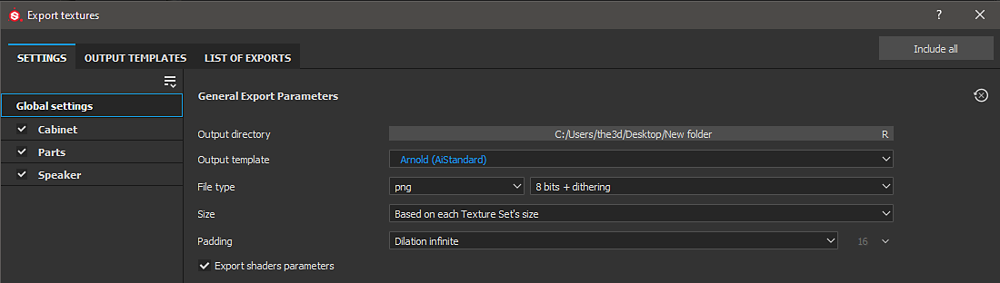

# 아놀드 - Substance Painter

Substance Painter 2020.1(6.1.0)은 [aiStandard 재질](https://docs.arnoldrenderer.com/display/A5AFMUG/Standard+Surface)을 사용하여 아놀드용 [출력 템플릿](https://experienceleague.adobe.com/en/docs/substance-3d-painter/using/getting-started/export/output-templates/export-presets)와 함께 제공됩니다.

{width="800px"}

## Arnold Standard Shader(Arnold 5 이상)

| Substance Painter 내보내기 | Arnold AiStandardSurface |
| --- | --- |
| 기본 색상 | 기본/색상 |
| 거칠기 | Specular / 거칠음 |
| 금속성 | 기본/금속성 |
| 표준 | (**Maya**) 지오메트리/범프 매핑/bump2d(접선 공간 표준으로 사용)(**3ds** **최대**) 비트맵 → 표준 |
| 높이 | (**Maya**) 변위 셰이더/변위 (**3ds** **Max**) 개체 수정자 → 아놀드 속성 → 변위 → 맵 사용 |
| 배출 | 방출/색상(방출 두께 = 1.0) |
| 비등방성 수준(기본 아놀드 출력 템플릿에 포함되지 않음) | (**마야**) 코트/비등방성 (**3ds** **최대**) 코트/비등방성 |
| 비등방성 수준(기본 아놀드 출력 템플릿에 포함되지 않음) | (**Maya**) 코트/회전 (**3ds** **최대**) 코트/회전 |

>[!NOTE]
>
> 자료를 나타내는 지도는 정확하게 해석되어야 할 것이다. 자세한 내용은 [색상 관리](../../../renderers/color-management/color-management.md)페이지를 참조하세요.
