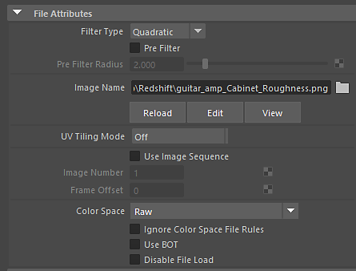

# Maya의 텍스처 Substance

맵에 설정하는 색상 공간은 [Maya 색상 관리 설정](https://help.autodesk.com/view/MAYAUL/2020/ENU/?guid=GUID-B260195C-A0FE-4F51-9EA2-099B61B7725A)에서 설정된 설정과 규칙에 따라 다릅니다.

Maya 플러그인의 Substance은 파일 노드에서 &quot;색상 공간 파일 규칙 무시&quot;로 설정됩니다. 플러그인은 다음을 사용하여 색상 관리에 관계없이 색상 공간 설정을 처리합니다.

BaseColor, 확산, 방출, Specular = sRGB\
표준, Height, 변위, 거칠음, 금속 = RAW

일반적으로 색상이 아닌 데이터를 나타내는 이미지의 경우 색상 공간을 RAW로 설정해야 합니다. 그러나 이 설정은 색상 관리에서 설정한 규칙의 영향을 받을 수 있습니다.

