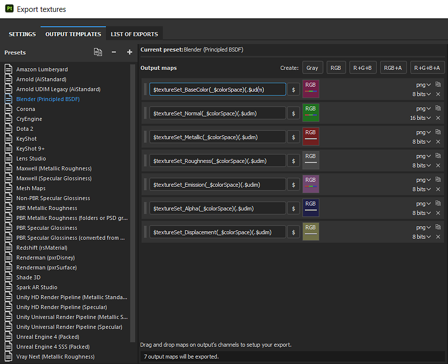

# 주기 및 이벤트 - Substance Painter

텍스처를 Blender로 내보내기 위해 사용자 정의 템플릿을 만들 수 있습니다.

1. PBR 금속 거칠기 템플릿을 선택한 상태에서 복제 버튼을 클릭하여 사본을 만듭니다.
1. [맵을 일반 RBG 정사각형으로 변환] 옵션을 드래그하고 &quot;RBG에서&quot;를 선택하여 [DirectX에서 OpenGL로 복사]의 [표준] 문자를 변경합니다.
1. 원하는 경우 사전 설정 이름 바꾸기

>[!NOTE]
>
> 자료를 나타내는 지도는 정확하게 해석되어야 할 것이다. 자세한 내용은 [색상 관리](../../../renderers/color-management/color-management.md)페이지를 참조하세요.
