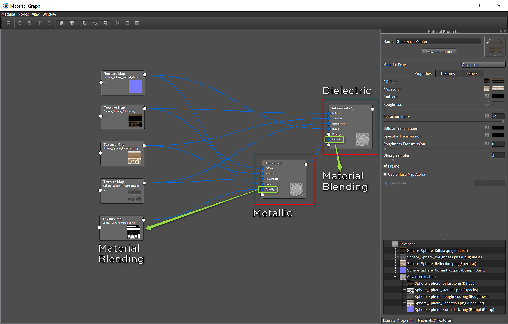

# Keyshot

*Keyshot 6.1.72*[&#x200B;예제 장면 다운로드](https://www.dropbox.com/s/rvjsbbcx7c74aah/keyshot.zip?dl=0)

## Substance Painter 내보내기

1. Keyshot의 경우 확산, 반사, 금속, 거칠기 및 표준(직접 X)을 사용하여 내보내기 사전 설정을 구성해야 합니다.

   

## 고급 자재 설정

2가지 고급 재질을 사용하게 됩니다. 하나는 금속 소재일 것이고 다른 하나는 유전체 소재일 것입니다.

1. 재질을 고급으로 설정하고 재질을 그래프로 표시합니다.

   **금속:**\
   a. 굴절 지수를 10으로 설정합니다\
   b. 아래 표에 표시된 대로 맵을 설정합니다

   | Substance Painter 텍스처 | 고급 재질 채널 |
   | --- | --- |
   | 확산 | 확산 |
   | 금속재질 | 불투명도 |
   | 표준 | 범프 \*일반 활성화 |
   | 거칠기 | 거칠기 |
   | 반사 | 반사 |

1. 새 고급 재질 만들기

   **유전체:**\
   a. [굴절률]을 1.5로 설정합니다\
   b. 아래 표에 표시된 대로 맵을 설정합니다

   | Substance Painter 텍스처 | 고급 재질 채널 |
   | --- | --- |
   | 확산 | 확산 |
   | 표준 | 범프 \*일반 활성화 |
   | 거칠기 | 거칠기 |
   | 반사 | 반사 |

1. 금속성 고급 재료의 출력을 가져와서 유전체 고급 재료의 +에 추가합니다. 그러면 재질에 [레이블] 필드가 생성됩니다.

   
