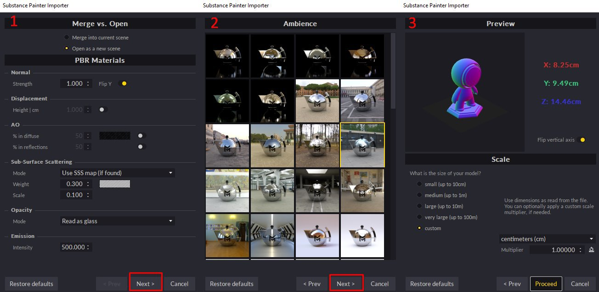

# Substance Painter 통합

>[!NOTE]
>
> **정보**
> 
> 중요: Substance Painter 설치 관리자에 사전 설정을 추가하십시오.\
> 여기에서 해당 세 가지 사전 설정을 다운로드할 수 있습니다.\
> <https://www.dropbox.com/s/11vuk0k0ob772mv/Maverick_Export_Pre>[sets.zip](https://www.dropbox.com/s/11vuk0k0ob772mv/Maverick_Export_Presets.zip)

다음 단계에 따라 Substance Painter 프로젝트를 Maverick으로 쉽게 가져올 수 있습니다.

**Substance** **Painter****:**

1. 메쉬를 내보냅니다.
1. Maverick 사전 설정(이미지 보기) 중 하나를 사용하여 메쉬가 있는 동일한 폴더에서 텍스처를 내보냅니다.

   

   *일반* *사례*&#x200B;에서 *선택* *&quot;**Maverick**사전 설정**&quot;

   *선택* *&quot;**Maverick* *고급* *사전 설정**&quot; if* *페인트한* *a* *특정&#x200B;**지도****17}* as **&#x200B;비등방성&#x200B;**&#x200B;또는&#x200B;**&#x200B;코팅**.**

   *귀하의* *모델에 관련* *변위&#x200B;**지도**가 있는 경우*&#x200B;선택&#x200B;**&quot;**Maverick**&#x200B;변위&#x200B;**사전 설정&#x200B;**&quot;.**이* *사전 설정**의지* *모든 높은&#x200B;**품질**모양&#x200B;**세부 정보**를 캡처하기 위해* *Maverick* *에 대해* *Height **맵****32비트를 내보냅니다.*

   **In** **Maverick****:**
1. Substance Painter 아이콘을 클릭합니다.

   
1. Substance Painter에서 내보낸 메시 파일을 선택합니다.
1. 가져오기 대화 상자의 지침을 따릅니다.

   * 첫 번째 대화상자 페이지에서 몇 가지 재료 매개변수를 설정할 수 있습니다.
   * 두 번째 대화 상자 페이지에서 모델이 표시될 환경을 선택할 수 있습니다.
   * 세 번째 대화상자 페이지에서 모델의 배율 및 축 방향을 선택할 수 있습니다.

   
1. 계속하면 모델을 텍스처 세트 및 재질이 자동으로 생성 및 적용되어 올바르게 구성합니다. 모두 조명 단계를 위해 준비되었습니다.

   **If** **사용자&#x200B;****수정****Substance의**&#x200B;텍스처&#x200B;**** Painter ****, 내보내기&#x200B;****&#x200B;다시&#x200B;****내보내기****,****&#x200B;덮어쓰기&#x200B;****&#x200B;더&#x200B;****&#x200B;이전&#x200B;********.** ****그런 다음****에서** **Maverick ****업데이트를 사용하세요****지도****&#x200B;아이콘****:**

   {width="800px"}

   다음 비디오 튜토리얼에서 전체 프로세스를 볼 수 있습니다.

   [**https://youtu.be/vw2RPGjPhh8**](https://youtu.be/vw2RPGjPhh8)
