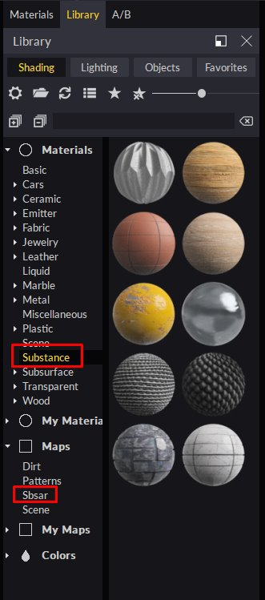

# Substance SBSAR 통합

**Substance Designer 또는 Substance에서** **쉽게****이져오기를** **SBSAR 파일** **생성** **** **Alchemist** **대상** **Maverick ****팔로우****중** **개** **이들** **2** **메서드****:**

**메서드** **1:**

1. SBSAR 아이콘을 사용하고 SBSAR 파일을 선택합니다.

   
1. 가져오기 대화 상자에서 다음과 같은 재질 매개변수를 설정할 수 있습니다.

   
1. 계속하면 재질이 [재질] 패널에 표시되고 장면에서 사용할 수 있습니다.

   

   **메서드** **2****:**
1. SBSAR 파일을 Windows 탐색기에서 장면의 임의 개체로 간단히 드롭합니다. [재질] 패널에도 SBSAR 파일을 놓을 수 있습니다.
1. 가져오기 대화 상자에서 다음과 같은 재질 매개변수를 설정할 수 있습니다.

   
1. 재질이 사용자가 놓은 개체에 적용됩니다.

   **팁 및 요령 :**
1. [재질] 패널에서 Substance 노드를 선택하거나 재질의 채널 플러그 중 하나를 클릭하여 SBSAR 매개 변수를 편집할 수 있습니다.
1. 512 또는 1024 해상도로 재질을 편집하여 더 유동적으로 편집하는 것이 좋습니다. 최종 렌더링의 경우 해상도를 2048 또는 4096으로 높일 수 있습니다.
1. 장면의 다른 개체에서 동일한 SBSAR을 사용하지만 매개 변수가 다른 경우 이를 복제하여 새 개체에 적용합니다. Maverick은 개별적으로 편집할 수 있는 새 재질을 자동으로 만듭니다.
1. 장면에 여러 SBSAR이 있는 경우 이러한 SBSAR 중 하나에서 &quot;전역 해상도로 설정&quot; 버튼을 사용하여 모든 SBSAR의 해상도를 한 번에 제어할 수 있습니다.

   
1. Maverick에는 [재질/Substance] 아래 및 [맵/Sbsar] 폴더에서 찾을 수 있는 10개의 [재질]과 [SBSAR]이 포함되어 있습니다.

   
1. Maverick에서 자신의 SBSAR을 사용할 수 있도록 하려면 하위 폴더를 만들어 배치합니다

   &quot;C:\Users\User\Documents\RandomControl\library\Shading\My 맵&quot;.

   그런 다음, 개체 위에 간단히 드롭하면 Maverick이 해당 래퍼 재질을 만들 수 있습니다.

   Maverick의 SBSAR 소개 비디오는 <https://youtu.be/HosZOoMRfcM>에서 볼 수 있습니다.

   Maverick에서 SBSAR를 사용하는 실제 예제는 <https://youtu.be/ebVI5jJD71A>입니다.

   **지원** **링크:**

   [gorilla@maverickrender.com](https://helpx.adobe.com/mailto:gorilla@maverickrender.com)&#x200B;(으)로 메일 보내기

   Maverick 웹 사이트 [www.maverickrender.com](http://www.maverickrender.com/)에서 채팅
