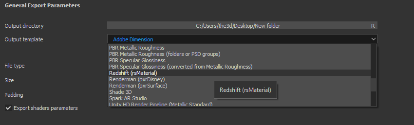

# 렌더러

[Substance Source](https://source.substance3d.com/)에서 제공되는 Substance 재질은 물리적 기반의 셰이더용 출력을 포함하며 [금속/거칠기(기본 작업 과정) 및 Specular/광택 작업 과정](https://academy.substance3d.com/courses/pbrguides)을 모두 지원합니다. 렌더러 재질이 지원하는 워크플로우를 이해하는 것이 중요합니다. 렌더러에 따라 Substance 질감 출력을 직접 사용하거나 출력 텍스처를 변환해야 할 수 있습니다. 사용자 정의 Substance 자료나 Substance share에서 다운로드한 자료에 지정된 렌더러에 필요한 출력이 들어 있지 않을 수 있습니다.

{width="200px"}

예를 들어 [Arnold] 또는 [Vray Next]에서는 금속/거칠기 출력을 직접 사용할 수 있습니다. 그러나 Renderman의 pxrSurface를 사용하면 기본 색상/금속성 출력을 확산 및 Specular 면 색상으로 변환해야 합니다. 렌더러가 지원되는 경우 Substance 통합 플러그인은 이러한 변환을 자동으로 처리합니다.

Substance Painter을 사용하면 지정된 렌더러에 필요한 적절한 맵 형식을 만드는 [출력 템플릿](https://experienceleague.adobe.com/en/docs/substance-3d-painter/using/getting-started/export/export-window/export-window)을(를) 선택할 수 있습니다. 기본적으로 렌더러가 지원되지 않는 경우에는 사용자 정의 출력 템플릿을 만들 수도 있습니다.

**Substance Painter 출력 템플릿**

{width="500px"}

## 렌더러 안내선

* [Substance 출력 변환](../renderers/converting-outputs/converting-substance-outputs.md)
* [색상 관리](../renderers/color-management/color-management.md)
* [아놀드](../renderers/arnold/arnold.md)
* [브레이](../renderers/vray/vray.md)
* [렌더맨](../renderers/renderman/renderman.md)
* [Redshift](../renderers/redshift/redshift.md)
* [맥스웰](../renderers/maxwell/maxwell.md)
* [코로나](../renderers/corona/corona.md)
* [옥탄](../renderers/octane/octane.md)
* [Keyshot](../renderers/keyshot/keyshot.md)
* [테아](../renderers/thea/thea.md)
* [Maverick](../renderers/maverick/maverick.md)
* [공구 백](../renderers/toolbag/toolbag.md)
* [주기 및 심지](../renderers/cycles-and-eevee/cycles-and-eevee.md)
