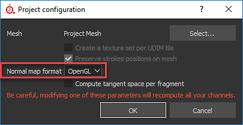

# 공구 백

이 페이지에서는 Toolbag 2에 대해 거칠음/금속성 출력을 사용하는 방법을 보여 줍니다.

Toolbag은 Specular/광택도 및 금속/거칠기 워크플로우를 모두 지원합니다.

Substance 3D Painter에서는 금속성 PBR 셰이더를 기본값으로 사용하지만 Specular/광택도 셰이더와 함께 사용할 수도 있습니다. 이 작업 과정에서는 Toolbag 2에 대한 금속성 출력을 사용하는 방법을 보여 줍니다. Toolbag은 금속 작업 과정을 지원합니다.

[예제 장면 다운로드](https://www.dropbox.com/s/qyed3un2zhtuibj/toolbag.zip?dl=0)

## Painter에서 내보내기

1. 기본 금속성 PBR 셰이더를 사용할 때 기본 문서 채널 + 표준 + AO 내보내기 사전 설정을 사용하여 내보낼 수 있습니다.  ***\*문서 채널은 프로젝트 구성에 따라 노멀 맵을 내보냅니다. 도구 모음은 OGL 노멀 맵이 필요합니다. 프로젝트 구성에서 표준 형식을 전환할 수 있습니다.***
1. 또는 광택도를 사용하는 사용자 정의 내보내기 구성을 만들 수 있습니다

   {width="600px"}
1. 내보내기 전에 [표준] 형식을 [OpenGL]로 변경할 수 있습니다.  **편집>프로젝트 구성**

   

## 재료 설정

1. 반사율을 금속성으로 설정
1. 반사를 GGX로 설정
1. 다음 차트에 표시된 대로 적절한 채널에 텍스처를 추가합니다.

   | Substance 3D Painter 텍스처 | 색상 공간 | 공구 백 재질 |
   | --- | --- | --- |
   | 기본 색상 | sRGB | 알베도 |
   | 거칠기 | sRGB 끄기 | 미세 표면 - 광택 - [반전]을 클릭합니다 |
   | 금속재질 | sRGB 끄기 | 반사율 - 금속도 맵 |
   | 표준 | sRGB 끄기 | 표준 |
   | 앰비언트 오클루전 | sRGB 끄기 | 오클루전 |

{width="600px"}
